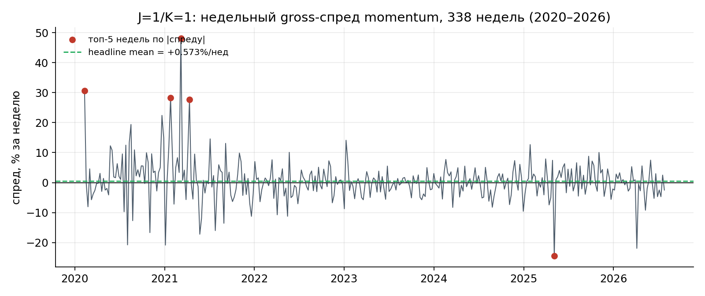
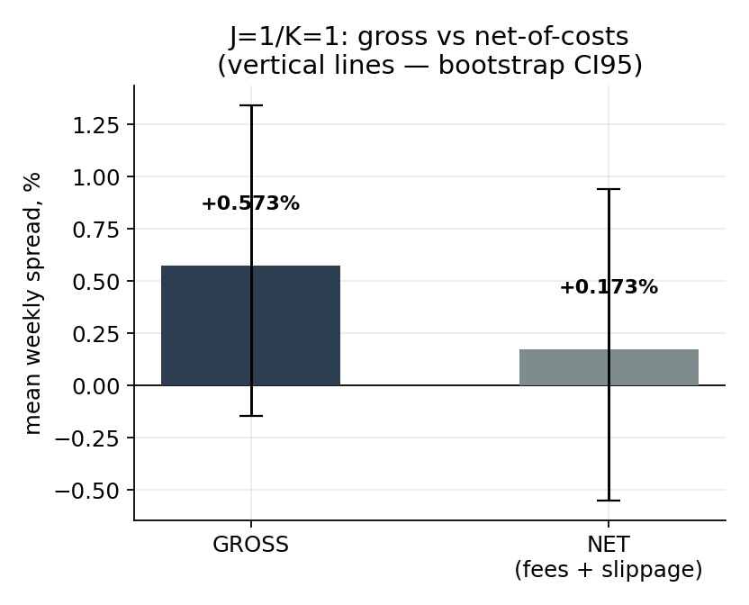
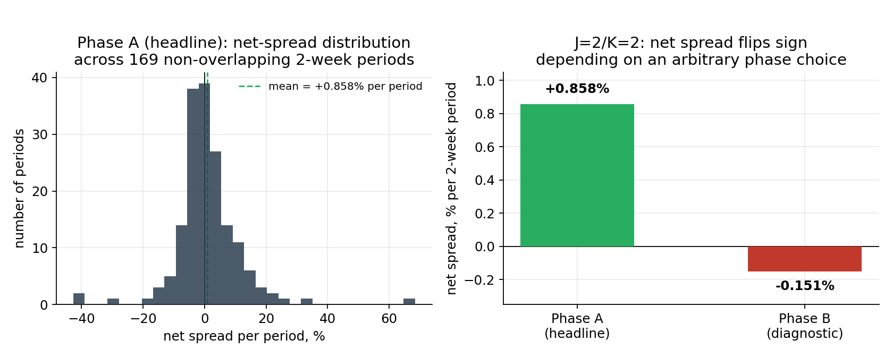
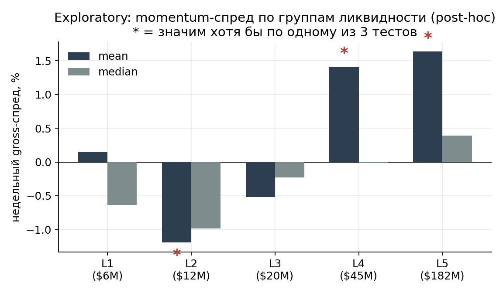

# 02 — Momentum: Evidence from a Binance Replication

**Status:** `Published`
**Class:** Empirically tested (own replication, gross and net-of-costs, significance tests) + Literature-based (fund practice, heavy tails)

**Research question:** on a practically tradable Binance universe (USDⓈ-M perpetual futures), does a cross-sectional momentum spread remain statistically distinguishable from zero after realistic trading costs — rather than only on paper, in an academic article or a theoretical gross backtest?

---

## 1. Why momentum was the first theory on the list

Cross-sectional momentum is probably the most replicated fact in academic finance: buy recent winners, sell recent losers, and over a long horizon the difference turns out positive more often than chance would predict. The effect has been documented across equities, currencies, commodity futures, and bonds over decades of data.

In cryptocurrencies it was first documented systematically by Liu, Tsyvinski, and Wu in "Common Risk Factors in Cryptocurrency" (NBER Working Paper w25882, final version in *The Journal of Finance*, volume 77, issue 6, 2022). Momentum is one of three factors in their model (alongside a market factor and a size factor), and the authors find it statistically significant across a broad sample of more than 1,700 coins.

This is the first theory in the series where a real practitioner attempted the trade, not just an academic paper: the fund Starkiller Capital published its own research in January 2023 with an honest in-sample/out-of-sample breakdown, whose out-of-sample window includes the 2021–2022 bear market. This is a rare case where the whole chain can be traced: academic finding → practitioner adaptation in a fund's own research → our own replication on a specific, actually tradable Binance universe.

## 2. What the underlying academic literature actually claims

Liu, Tsyvinski, and Wu test cross-sectional momentum on a CoinMarketCap sample, ranking coins by past return (`r`) over several formation horizons (1–4 weeks; denoted `r1,0`…`r4,0` in the paper's own notation). On the full universe of their sample, the long-short spread is statistically significant across all four formation horizons at once: `+2.7%/week` (1 week), `+3.3%/week` (2 weeks), `+4.1%/week` (3 weeks — the strongest and most statistically robust horizon in their grid, `t = 2.742`), `+2.5%/week` (4 weeks). This is the headline result of the main paper — a broad effect across the whole universe, not just one segment of coins.

Separately, in the same main text of the paper (not only an appendix), the authors additionally check how this effect is distributed by coin size: a double sort first splits coins into two groups by market cap (median), then within each group sorts on 3-week momentum into quintiles. Here the result is different: below-median-cap coins show a long-short spread of `0.6%/week`, statistically insignificant, while above-median-cap coins show `4.2%/week`, significant. A presentation by the same author (Yukun Liu, conference slides, November 2019, slide 20) gives a closely related, though not identically worded, result for the same double sort: large coins `+4.2%/week` (`t = 2.834`, significant), small coins `−1.1%/week` (`t = −0.563`, not significant, opposite sign). The correct reading of this part of the finding: a substantial share of the momentum effect in this paper is concentrated among larger, more liquid coins — but this is an additional, narrower cut inside the paper, not a summary characterization of the headline result itself, which is significant across the full universe on its own.

The authors themselves also plainly acknowledge an operational problem with the strategy (presentation, slide 27, verbatim): *"Strategies require shorting coins – difficult or impossible to do."* Checking what happens if the bottom-quintile short leg is replaced with shorting Bitcoin, and controlling for their own three-factor model, shows that the momentum alpha nearly disappears: `r1,0` — `+2.5% → −1.6%`, `r3,0` — `+2.8% → −0.1%`.

This is not our own critique — these are limitations visible directly in the primary source, once you read the author's own presentation rather than just the paper's headline result.

## 3. How a real fund tested the theory: Starkiller Capital

Starkiller Capital (Leigh Drogen, Corey Hoffstein, Kevin Otte) published "Cross-sectional Momentum in Cryptocurrency Markets" in January 2023 (SSRN 4322637; also on the fund's site, starkiller.capital) — an asset manager, not a blog, with an honest in-sample/out-of-sample breakdown that includes the 2021–2022 crash.

Key differences from LTW's setup: a 15–35 day formation horizon (considerably longer than LTW's 1–4 week horizons), weekly rebalancing, and a full 2018–2022 sample period with an honestly separated out-of-sample window (from March 2021 to the end of the sample — a period that captures the 2022 bear market).

Their results for this out-of-sample period are not about "making money" but about "losing less than the market": the top quintile by their momentum criterion lost `−2.35%` annualized, against `−29.93%` for an equal-weighted market portfolio and `−37.82%` for Bitcoin. Momentum did not produce a profit in absolute terms over this window, but it clearly beat the market in relative terms — a separate, real form of value, though not the kind usually meant by a "working strategy."

They give a concrete cost threshold at which the strategy stops being viable: at 125 basis points of total costs, the top quintile underperforms the benchmark. At 50 bps, annualized return drops by 30 percentage points in-sample and 12 percentage points out-of-sample. Their cited typical rates are Binance maker/taker around 10 bps, Coinbase 10–20 bps. We use this figure (125 bps) as an external, independently published anchor when interpreting our own costs — not because it has to match our situation literally, but because it comes from a practicing fund, not from us with hindsight.

The fund is candid about drawdown: even over the successful full sample, the top quintile drew down more than 75% several times over the period — not a strategy malfunction, but a property of the phenomenon itself.

A telling architectural choice: they chose long-only rather than long-short, explaining directly that shorting the broad tail of coins is difficult and expensive — funding is unstable, and short-side liquidity is concentrated on a handful of exchanges, Binance among them. Our own replication has a formal advantage here: it uses Binance perpetuals, where shorting is technically as accessible as going long — but that is an advantage in executability, not a guarantee that the effect actually exists on our universe.

Finally, they added a risk overlay as a separate, explicitly labeled layer on top of the base momentum factor: exit to cash when Bitcoin's price trend turns down (a 5/50 EMA on BTC price). With this overlay, the result is markedly better: `93.3%` annualized versus `37.8%` without it, drawdown `45%` versus `75%`. A methodologically important detail for our own discipline: the overlay here is a separate, independently tested layer, not part of the momentum factor itself. We follow the same principle: the gate results described below test the bare momentum spread, with no regime filters or stops layered on top.

## 4. Our own replication: methodology

Lab 06 is a system independent of Klines: it is not a feature check for the live detector, but a standalone test of an academic hypothesis on a specific, actually tradable universe — 832 Binance USDⓈ-M perpetual symbols, a daily-close panel, 2020-01-01 → 2026-07-31 (2,404 days).

A deliberate departure from LTW and from the full CMC universe: the universe is intentionally restricted to Binance perpetuals, rather than expanded to the thousands of market-cap-ranked coins on CoinMarketCap. The reasons were fixed in advance: (1) a broader multi-exchange universe would introduce survivorship bias at the level of the exchanges themselves (venues like FTX no longer exist); (2) a well-known problem in the literature — momentum returns on illiquid names evaporate once spread and slippage are honestly accounted for, and Binance perps physically exclude the most illiquid tail of the CMC universe. It's worth explicitly resolving an internal tension here with an early working assumption of the project (recorded on 05.08, before reading Liu's paper and presentation in full): the decision was originally explained by the claim that "momentum in LTW is strongest among small/illiquid coins" — but Section 2 of this note, based on a later and more precise reading of the primary source, shows the opposite: an additional double sort in the paper and presentation themselves finds a substantial part of the effect specifically among larger, more liquid coins. That makes the Binance-perp universe — skewed toward larger, actually listed and traded assets — not a self-evidently unfavorable setting for testing this effect, but a neutral or even favorable one, contrary to what was assumed at the early planning stage. We leave this discrepancy visible rather than quietly rewriting the earlier framing: it shows how, over the course of the project, a more precise reading of the primary source corrected an earlier working assumption.

Methodology fixed before looking at the result (pre-registration):

- ranking date — Sunday close; entry — Monday open; exit — the following Monday's open (for J=1/K=1);
- trailing momentum — 7 calendar days;
- quintile baskets, equal weights, top quintile long, bottom quintile short;
- headline liquidity threshold — trailing 30-day median daily turnover ≥ $1,000,000 (an absolute number, fixed before looking at returns, not a relative decile/quintile of the universe);
- explicit, pre-fixed rules for delisting or a missing price at entry or exit (forced close at the last available price, with the reason tracked separately — delisting vs. sample edge);
- significance — three tests, each with its own model of data dependence: a weekly bootstrap confidence interval, a weekly sign-flip randomization test, and a within-week permutation test (reshuffles coins between the two legs within the same week, preserving basket sizes).

This explicit pre-registration is not a formality: the methodology was checked after the fact against the LTW paper itself (Internet Appendix and code). One substantive difference, flagged in advance rather than after the fact, is confirmed directly in the source text: the canonical quintile portfolios in the headline tables of the main LTW paper (Table 3–7, including Table 4 for momentum) are constructed as **value-weighted** — basket return is weighted by market capitalization, not split evenly across coins. Our implementation uses equal-weighted baskets. This isn't our guess: the phrase "the mean returns are the time-series averages of weekly value-weighted portfolio excess returns" is repeated verbatim in the caption of each of these tables. The paper's appendix separately reports robustness checks on other portfolio constructions (in particular, portfolios sorted by pre-ranking beta), but that does not change the fact that the main paper's headline construction is value-weighted.

### Where the data actually came from: not "downloaded and computed"

The headline result reads easily as one line — "a panel, 832 symbols, 2020–2026." Behind it sit several decisions, each of which directly affects whether the final number can be trusted, and each of which was a separate potential source of error if left unchecked.

**Where the symbol list came from, and why that's not trivial.** The obvious way to get a list of tradable USDⓈ-M perpetuals is a call to the live `/fapi/v1/exchangeInfo` endpoint. That path was deliberately rejected: `exchangeInfo` returns only what is trading right now, and any coin delisted over the years simply disappears from it. For the short leg of a momentum strategy, that's not a random error — it's a systematic error in the result's favor: the backtest retroactively rids itself of "dying" weak assets, which are exactly what should have made up the most informative part of the short basket. Instead, the symbol list and the full price history come from `data.binance.vision` — Binance's public S3 archive, which retains historical files regardless of a coin's current listing status. A check made at the time the script was written: the archive held 832 USDT-perp symbols, 31 of which are present in the archive but already absent from `exchangeInfo` (among them AERGOUSDT, AKROUSDT, ANCUSDT, ANTUSDT, BTCSTUSDT, BZRXUSDT, BTTUSDT). Those 31 coins are exactly what a simpler approach would have silently lost — exactly the survivorship bias the paper's own methodology requires avoiding at the data-source level, not just declaratively.

**Download with checkpoints, not one shot.** The download script does not guess or hard-code a month range for each symbol — for every symbol it pulls the exact list of available files from that symbol's own S3 listing, which rules out both truncated history and a flood of 404 errors on months that don't exist. The run is built to survive interruption: a two-level checkpoint (a cache of per-symbol file listings in `manifest.json`, plus a check for an already-downloaded, valid file on disk) allows the download to be safely stopped at any point and resumed without re-listing all 832 symbols.

**The panel passed five independent checks — it wasn't taken on faith.** After the panel was assembled (2,404 days × 832 symbols, 2020-01-01 → 2026-07-31), it was verified five different ways before any spread calculation ran on it: (1) the shapes of `panel_open` and `panel_close` match exactly — 612,421 non-empty cells in both, zero discrepancies; (2) a bitwise check of values against the raw zip archives, including one confirmed-delisted symbol — verifying that delisting didn't break parsing; (3) missing-value (NaN) masks match cell-for-cell between `open` and `close`; (4) a decisive test for hidden forward-fill — if missing prices had been silently carried forward from the previous day, the match rate between `open[t]` and `close[t-1]` would be close to 100%; in reality it came out to 42.5%, with a median discrepancy of 0.0079%, confirming the panel holds real, not forward-filled, values. As a side effect, this check surfaced and explained a pattern of repeated prices for a few coins (e.g., BTCSTUSDT) — the source had frozen trading on these symbols, volume is zero, confirmed against the raw data; this is not a panel bug, and such coins are filtered out by the liquidity threshold in the next step rather than silently contaminating the sample.

None of these checks were a formality for the write-up: forward-fill, for instance, is exactly the kind of hidden error that quietly inflates statistical significance, because it manufactures the appearance of data where none exists.

The core ranking-and-basket logic — no look-ahead, forced-close reasons tracked, not silently dropped — looks like this in the actual script:

```python
for entry_ts in mondays:
    exit_ts = entry_ts + pd.Timedelta(days=HOLDING_DAYS)
    rank_ts = entry_ts - pd.Timedelta(days=1)                    # Sunday
    mom_ts  = rank_ts - pd.Timedelta(days=MOMENTUM_LOOKBACK_DAYS)

    # ── momentum: strictly from data BEFORE entry ────────────────────────
    c_rank = at(cl, rank_ts)
    c_prev = at(cl, mom_ts)
    ok_mom = c_rank.notna() & c_prev.notna() & (c_prev > 0) & (c_rank > 0)

    # ── liquidity: window ends at the ranking date ───────────────────────
    liq_win = vol.loc[(vol.index > rank_ts - pd.Timedelta(
        days=LIQUIDITY_LOOKBACK_DAYS)) & (vol.index <= rank_ts)]
    ok_liq = (liq_win.notna().sum() >= MIN_LIQUIDITY_OBS) & \
             liq_win.median(skipna=True).notna() & \
             (liq_win.median(skipna=True) >= min_liquidity)

    # ── entry: Monday open is mandatory ──────────────────────────────────
    # If the entry Monday's open is missing, the symbol is excluded — the
    # next available price is NOT substituted, since that would shift entry
    # forward with hindsight knowledge of what happened next.
    o_entry = at(op, entry_ts)
    ok_entry = o_entry.notna() & (o_entry > 0)

    eligible = ok_mom & ok_liq & ok_entry
    syms = eligible[eligible].index
    mom = (c_rank[syms] / c_prev[syms] - 1) * 100

    k = max(1, len(syms) // N_QUANTILES)
    order = mom.sort_values(ascending=False)
    longs, shorts = list(order.index[:k]), list(order.index[-k:])
```

The full script — including forced-close handling (delisting vs. sample-edge, tracked as two distinct, non-interchangeable reasons), the cost model, and the three significance tests — is published alongside this note in [`replication/`](replication/).

## 5. Gross result: weak, but not clean-cut

Over the full history (338 independent weeks, 2020-02 → 2026-07, median universe size after the liquidity filter — 175 coins), the headline spread before costs:

| leg | mean across weeks | median across weeks |
|---|---|---|
| LONG (top quintile) | +1.055% | −1.542% |
| SHORT (bottom quintile) | +0.482% | −1.000% |
| **SPREAD (long − short)** | **+0.573%** | **+0.413%** |

The share of weeks with a positive spread is 52.7% (178 of 338). The dispersion is large: the standard deviation of the weekly spread is 6.94 percentage points — a typical week's swing is almost 12 times the average effect itself. This is easier to see on a chart than in numbers:



The five marked points are the same weeks discussed below (the outlier/jackknife section): the headline line (green, +0.573%/week) sits almost at zero against a range that, in individual weeks, reaches +48% and −24%.

Significance tests on this gross result disagree with each other:

| test | result |
|---|---|
| 95% bootstrap CI | [−0.147% … +1.340%] — covers zero |
| weekly sign-flip | p = 0.134 — not significant |
| within-week permutation | **p = 0.035 — significant** |

One of the three tests is formally significant, two are not. We don't treat this as grounds to call the effect confirmed: the project's rule is that a gate decision is made after accounting for costs, not on the gross number, however tempting a partial match to expectations might be.

A check for sensitivity to individual extreme weeks (outlier/jackknife) found no dependence of the result's sign on one or two weeks: dropping the top-5 weeks by absolute spread lowers the headline to +0.250% (from +0.573%), but the sign doesn't change, and a leave-one-week-out jackknife gives a range from +0.432% to +0.647% — the effect isn't "made" by a single outlier, unlike what's discussed below regarding the academic literature.

## 6. Net-of-costs: where the spread goes

The cost model was fixed before the calculation, not tuned to the result: a Binance USDⓈ-M taker fee of 0.05% per side (no VIP discount — this is a base, not a preferential scenario), plus an assumed 0.05% per side of slippage. Round-trip (entry + exit), that's 0.20% on one leg and 0.40 percentage points on both legs per week. Taker rather than maker was used deliberately: scheduled weekly rebalancing requires entering at market at the start of the week — limit execution isn't guaranteed.

A limitation on funding is stated separately and honestly: the available funding-rate archives cover only 7.7% of all positions and **zero weeks** with full basket coverage — substituting zero for missing data would implicitly claim that funding was zero, which the data doesn't support. A rough estimate on the covered positions suggests funding's contribution would be about `+0.07` percentage points — second-order relative to the 0.40 pp of costs, but this is a directional signpost, not a measurement.

The result after commissions and the slippage assumption (funding excluded, for the reasons above):

| series | mean/week | median/week | weeks > 0 | bootstrap CI95 | p sign-flip | p permutation |
|---|---|---|---|---|---|---|
| GROSS | +0.573% | +0.413% | 52.7% | [−0.147% … +1.340%] | 0.134 | 0.035 |
| **NET** (fees + slippage) | **+0.173%** | **+0.013%** | **50.0%** | **[−0.551% … +0.941%]** | **0.653** | **0.804** |



Both confidence intervals already cover zero at the gross level; after costs, the interval doesn't just widen in relative terms — it shifts noticeably closer to the negative region.

Costs eat 0.40 of the 0.573 percentage points — about 70% of the gross spread. The remaining net spread is positive in sign but fails all three significance tests: the confidence interval widely covers zero, both p-values are well past conventional thresholds, the median week produces almost exactly nothing, and the share of profitable weeks falls precisely to 50.0%.

Worth noting separately is an independent external check of the same question on a different universe: Dobrynskaya ("Cryptocurrency Momentum and Reversal," HSE University working paper, ~2,000 CoinMarketCap coins, 2014–2020, not our data or our code) finds, on the same J=1/K=1 specification, a positive but statistically insignificant effect (`t = 0.80` conventional, `t = 0.76` Newey-West) — qualitatively the same result as our gross headline. This doesn't remove our own weak significance, but it does say that the weakness of the 1-week horizon isn't an artifact of our particular Binance implementation.

## 7. Why even the significance statistics deserve caution

A finding independent of our own calculations matters here. Grobys and coauthors (Grobys, Kolari, Sandretto, Shahzad, Äijö, "Cryptocurrency momentum has (not) its moments," *Financial Markets and Portfolio Management*, volume 39, 2025) model the tail behavior of momentum-strategy returns for large-cap cryptocurrencies and find that the variance of the return distribution is statistically undefined — the realized variance of the momentum spread follows a power law with an exponent `α < 3`, which formally implies an infinite theoretical variance. Their own illustration of the scale: a single outlier (0.24% of observations) accounted for 37% of the momentum strategy's total compounded return over the sample period.

What this means for interpretation: sample t-statistics, Sharpe ratios, and confidence intervals can, of course, still be computed — the question is how reliable the standard asymptotic inference behind them is when the underlying process has no finite variance. Under this kind of heavy-tail behavior, conventional t-tests, Sharpe-based inference, and ordinary confidence intervals can lose their standard statistical properties and become unreliable indicators — not because the arithmetic is wrong, but because the assumption (finite variance) their usual interpretation rests on may not hold for this class of strategies. Section 5 above contains two distinct observations that shouldn't be conflated: the weekly jackknife itself (how stable the headline mean is to dropping one week) gives a narrow range, +0.432%…+0.647%, whereas individual extreme weekly spread observations (the top-5 weeks by absolute value, before they're dropped from the sample) reached +48% and −24% against a headline mean of +0.57%. It's this second fact — the range of individual weekly outcomes, not the jackknife itself — that qualitatively matches the symptom of heavy tails, though we did not run a formal power-law exponent estimate on our own data.

This doesn't overturn our net result — it's already indistinguishable from zero across three separate tests. But it is a reason to treat the confidence intervals and p-values themselves with additional caution: if the distribution genuinely has heavy tails, the usual significance tools are less reliable than they appear, and in both directions — for rejecting a hypothesis and for confirming one.

Separately, the same paper by Grobys and coauthors finds that for large-cap coins and a specific subperiod (January 2016 – July 2020), the momentum strategy earned `1.74%` per week — but significant only at the 10% level, and the authors directly link this to the possibility that the result reported in LTW may be driven mainly by small-cap, illiquid coins (their exact wording: "possibly attributable to small-cap cryptocurrencies lacking liquidity"). Starting from the end of their paper's sample period (after July 2020), average momentum returns turn negative and statistically insignificant — consistent with an earlier, entirely independent finding by Grobys and Sapkota: on a sample of 143 coins over 2014–2018 (that is, before and with almost no overlap with LTW's window), they find no significant momentum premium at all (Grobys, K., Sapkota, N., "Cryptocurrencies and momentum," *Economics Letters*, 180, 2019, 6–10 — the paper's own headline finding, verbatim: "We find that momentum is insignificant in the 2014–2018 sample period"), and also with a finding by Shen and coauthors (2020).

It's important not to conflate this with what's said in Section 2. Grobys and coauthors' hypothesis about the role of small, illiquid coins is their own interpretation of where the LTW result comes from, not a direct measurement of the size effect. It directly diverges from the empirical double sort in Liu's own presentation (Section 2), where the size×momentum effect is measured directly and turns out to be stronger precisely among large coins, not small ones. We're not trying to resolve this disagreement between two sources here — both are published independently of us, and resolving it isn't this note's job; what matters for this note is simply not presenting two diverging claims as one and the same.

## 8. Why J=2/K=2 specifically: two independent sources, not a random pick

Before moving to the second specification, it's worth showing where it came from — this wasn't us picking the next parameter at random after the first one failed.

Li and Zhu (Li, J., Zhu, Y., "A LASSO Type Factor Model in Cryptocurrency," working version dated August 25, 2024) test 49 anomalies on the full CoinMarketCap dataset across three separate periods: in-sample (January 2014 – July 2020, the same window as LTW), out-of-sample (August 2020 – December 2023), and the full sample (2014–2023); separately, as an additional robustness check, on a top-100-by-market-cap subsample. Their own Table 3 (single-sort, value-weighted quintile portfolios) gives exact figures for the whole momentum group across the three periods:

| horizon | in-sample | out-of-sample | full sample |
|---|---|---|---|
| `r1,0` (1 week) | 3.6% (t=2.635) | 1.6% (t=2.317) | 2.9% (t=3.157) |
| `r2,0` (2 weeks) | 4.0% (t=3.779) | 3.8% (t=4.943) | 3.9% (t=5.322) |
| `r3,0` (3 weeks) | 4.0% (t=3.831) | 2.2% (t=3.026) | 3.3% (t=4.662) |
| `r4,0` (4 weeks) | 3.1% (t=3.065) | 2.0% (t=2.743) | 2.7% (t=3.871) |

A precision worth keeping rather than smoothing over: `r1,0` (the same one-week formation horizon we use, though not necessarily with a matching holding-period definition) is statistically significant across all three periods of this study — this isn't a case where the one-week horizon formally breaks. But it is consistently, in every column, the weakest within the momentum group by t-statistic and by effect size. `r2,0`, by contrast, is the strongest by t-statistic in two of the three periods (out-of-sample and full sample), and in-sample it only marginally trails `r3,0` (t=3.779 vs. 3.831 — a difference on the edge of noise). An independent corroboration of the same conclusion: the authors themselves, selecting factors for their own three-factor model (DS3) via Lasso, chose two-week momentum (`MOM2`) — not one-week — as the momentum component, alongside the market factor and residual momentum.

This doesn't contradict Sections 6–7 of this note — it's the same convergence on a specific formation horizon, not on momentum as a class, that Dobrynskaya already showed: for both her and for Li and Zhu, independently, the one-week formation horizon (closest to our own J=1/K=1) turns out to be the weakest of the tested versions (though, unlike our result, still significant on their data), while the two-week formation horizon is the most robust. In other words, the weakness we observe in Sections 5–6 on our own specification is tied to the one-week horizon on our specific universe — not to momentum as such, and not to the one-week horizon in general, which remains significant on the full CMC market.

This is exactly why the second tested specification was chosen in advance, not arbitrarily, but per the project's internal protocol (`SYSTEM3_ROADMAP.md`, fixed on 07.08, before the net-of-costs result for J=1/K=1 was in): if J=1/K=1 fails the net-of-costs check, exactly one literature-backed alternative is permitted — J=2/K=2. A caveat worth being precise about: Li & Zhu's `r2,0` is a 2-week formation-horizon single-sort, not a specification defined with a matching 2-week holding period — it isn't literally the same construction as our J=2/K=2, and we don't treat it as such. What it and Dobrynskaya (2021) do give, independently of each other, is converging evidence that a 2-week formation horizon is the stronger, more robust one on crypto data — which is the reason a 2-week formation (paired with a 2-week holding period, our own project convention for pairing J and K) was the specification chosen, not a literal match to either source's exact construction. Any other combination is explicitly excluded — J=3/K=2, J=4/K=1, and so on: searching through parameters after the first specification failed would already be fitting to the desired result, not testing a published, pre-selected hypothesis. After the verdict on J=2/K=2, the Momentum class is considered fully investigated, regardless of outcome — no further parameter search is on the table.

This makes what happened next more weighty than if J=2/K=2 had just been a "second attempt": two independent sources pointed specifically to this horizon as stronger and more robust — and even it didn't survive the check on our universe.

Implementation: 2-week momentum, 2-week holding, non-overlapping periods (overlapping cohorts would produce an autocorrelated series and understate the p-values of all three tests, which are built on an assumption of independent observations).

The non-overlapping scheme splits Mondays into two mutually exclusive phases. Both were declared in advance — Phase A as headline, Phase B as diagnostic — precisely so that choosing a phase after seeing the result wouldn't turn into a hidden post-hoc selection.

| series | periods | mean/week | median/week | tests passed |
|---|---|---|---|---|
| NET Phase A (headline) | 169 | +0.429% | +0.036% | 0 of 3 |
| NET Phase B (diagnostic) | 169 | −0.076% | −0.327% | 0 of 3 |

(Values normalized to weekly for comparability with J=1/K=1; in raw units per holding period — Phase A: `+0.858%` over 2 weeks, Phase B: `−0.151%` over 2 weeks.)



On the left — the full distribution of the net spread across all 169 Phase A periods: the positive mean is driven largely by the right tail (a handful of periods return +30–65%), not by a typical period, which fits neatly with Section 7's heavy tails. On the right — the sign reversal itself: the only difference between the two bars is which Monday the non-overlapping 2-week windows were counted from.

Neither phase passes any of the three significance tests. But what turned out to be decisive for interpretation wasn't the insignificance itself — it was the difference between the phases: Phase A gives a positive net result, Phase B a negative one, a difference of 1.0 percentage points per period. The only difference between the phases is which Monday the non-overlapping periods start counting from — an arbitrary choice carrying no market information, and it flips the sign of the result. This is evidence, independent of the p-values, in favor of a "noise" conclusion: even if one phase had formally passed a significance test, that specific number couldn't be trusted, knowing that an equally valid neighboring alternative gives the opposite sign.

On the economics, J=2/K=2 does have lower relative costs — rebalancing half as often means the 0.40 pp of costs is spread over 2 weeks, i.e., 0.20 pp/week versus 0.40 pp/week for J=1/K=1. This doesn't save the result: Phase A's positive net spread is still indistinguishable from zero, and the sign of the effect is unstable with respect to an arbitrary choice of phase.

## 9. What this does — and doesn't — mean

Both literature-backed realizations permitted under the "exactly one alternative" rule — J=1/K=1 and J=2/K=2 — have now been run on our universe. Under the project's internal protocol, the Momentum class in this specific, fixed formulation is closed to further parameter variation: searching for new J and K values after both specifications failed the net-of-costs check would be fitting to a desired result, not an honest test.

It's worth being clear about what this result does **not** claim.

It's not a refutation of momentum as an academic phenomenon. The effect is documented across tens of thousands of securities and assets over multi-year periods in peer-reviewed literature that long predates this work; our 338 independent weeks (J=1/K=1) and 169 non-overlapping two-week periods (J=2/K=2) on one specific universe simply can't confirm or refute a result backed by evidence at that scale. Our own result only says that on this specific Binance universe, in this specific 2020–2026 window, and under these specific, realistic costs, the effect isn't statistically separable from noise.

It's not a claim that momentum "doesn't work on Binance in principle." A separate exploratory cut by liquidity group (devised only after seeing the weak headline — strictly post-hoc status, not confirmation) showed a direction consistent with Yukun Liu's finding of concentration in large coins: the highest-turnover group produced a spread of `+1.638%/week` (gross, significant across all three tests), while the gradient across liquidity groups turned out to be non-monotonic, and some of the "significant" groups are carried by their mean while the median is negative. This is a hypothesis to test on independent data, not a result — it emerged after looking at the headline and requires its own, pre-committed methodology before it can be considered a found effect.



The non-monotonicity is visible right in the chart: L1 (the least liquid group) shows a positive mean, while L2 and L3 are negative, and only from L4 onward does the picture align with the hypothesis. Asterisks mark the groups significant on at least one of the three tests (L2, L4, L5) — including L2, where the effect is significant but with the opposite sign relative to the hypothesis, which on its own doesn't fit a simple "more liquid, stronger effect" story.

Nor is this a claim about proven profitability for any realization of momentum in crypto at all — Starkiller Capital, a real asset manager with an honest public track record, also didn't make money in absolute terms over its own out-of-sample period (Section 3), even though it clearly beat the market in relative terms.

## 10. Verdict

We split this into three tiers of evidence, as in the previous note in this series.

**What is confirmed by multi-year peer-reviewed literature on the broad market (not by us):** cross-sectional momentum as a statistically significant anomaly exists across large cryptocurrency samples over multi-year periods (Liu, Tsyvinski, Wu, 2022), and additional size-sorted evidence shows the spread is substantially stronger among larger coins (Yukun Liu's 2019 presentation) — though this is a narrower, additional cut of the paper's data, not a summary characterization of its headline, whole-universe result.

**What is shown in a published practitioner study by an asset manager (not by us):** Starkiller Capital's out-of-sample backtest, spanning the 2021–2022 bear market, clearly beat the market in relative terms even though it didn't produce a profit in absolute terms; the fund gave an independent cost threshold (125 bps) that kills the effect, and showed that a regime overlay on top of the bare momentum factor substantially improves the risk profile in their backtest — but that is a separate, independently tested layer, not part of the factor itself. We are relying here on their published backtest, not on a confirmed fact of this strategy's live execution on real capital.

**What our own replication on an actually tradable Binance universe showed:** neither of the two specifications permitted under the project's rule (J=1/K=1, J=2/K=2) produces a net-of-costs spread distinguishable from zero on even one of three independent significance tests. The gross effect — while partially statistically significant on one of three tests for J=1/K=1 — is of the same order of magnitude as realistic execution costs, and disappears into noise once they're subtracted. J=2/K=2's result is, on top of that, unstable in sign with respect to an arbitrary choice of rebalancing phase.

## 11. What this means for a retail trader

If reading an academic paper or an attractive gross backtest convinced you that cross-sectional momentum is a ready-made, replicable strategy for the crypto market, this study is direct grounds to revisit that confidence as applied to your own, actually tradable universe of instruments. The costs in this work aren't a hypothetical half-percent haircut "for conservatism" — they're concrete numbers fixed before the calculation (a taker fee and a modest slippage assumption), and it's exactly those, not any flaw in the momentum hypothesis itself, that turn a formally positive gross spread into statistical noise.

This doesn't mean momentum as a phenomenon is a myth, or that a more elaborate implementation (longer horizons, a narrower liquid universe, a separately tested regime overlay like Starkiller's) couldn't show a different result. It means that the simplest, letter-for-letter implementation of an academic specification on a real, tradable universe of instruments is not a free lunch you can lift off a paper's page and run as-is.

---

## Changelog

- `v0.1`–`v0.6` (Russian draft, internal) — built from verified primary sources (LTW 2019 presentation slides, Starkiller Capital SSRN 4322637, Grobys et al. 2025 FMPM, Dobrynskaya HSE working paper, Li & Zhu 2024, Grobys & Sapkota 2019, and our own Lab 06 gate-check / Step 3 / Step 4 results), through several editorial rounds that removed overclaiming, resolved an internal contradiction about coin size and momentum, distinguished jackknife from individual outlier weeks, softened the infinite-variance claim to a question about inference reliability rather than the statistics themselves, and added four figures built directly from the lab's own CSV output.
- English adaptation — published alongside the replication code and figures in this repository.

## References

- Liu, Y., Tsyvinski, A., Wu, X. (2022). "Common Risk Factors in Cryptocurrency." *The Journal of Finance*, 77(6). Also circulated as NBER Working Paper w25882.
- Liu, Y. Conference presentation slides (Nov 2019) — double-sort size × momentum results and shorting-constraint discussion.
- Drogen, L., Hoffstein, C., Otte, K. (2023). "Cross-sectional Momentum in Cryptocurrency Markets." Starkiller Capital, January 2023. SSRN 4322637.
- Grobys, K., Kolari, J., Sandretto, D., Shahzad, S. J. H., Äijö, J. (2025). "Cryptocurrency momentum has (not) its moments." *Financial Markets and Portfolio Management*, 39, 443–476.
- Dobrynskaya, V. "Cryptocurrency Momentum and Reversal." HSE University working paper.
- Li, J., Zhu, Y. (2024). "A LASSO Type Factor Model in Cryptocurrency." Working paper, Central University of Finance and Economics.
- Grobys, K., Sapkota, N. (2019). "Cryptocurrencies and momentum." *Economics Letters*, 180, 6–10.
- Moskowitz, T., Ooi, Y. H., Pedersen, L. H. (2012). "Time Series Momentum." *Journal of Financial Economics*, 104(2). (Background reference for the time-series/cross-sectional momentum distinction.)
- Han, Y., Zhou, G., Zhu, Y. "Taming Momentum Crashes: A Simple Stop-Loss Strategy." SSRN 2407199. (Background reference on momentum crash risk and stop-loss overlays — referenced for context on why risk overlays are treated as a separate hypothesis, not tested in this note.)
