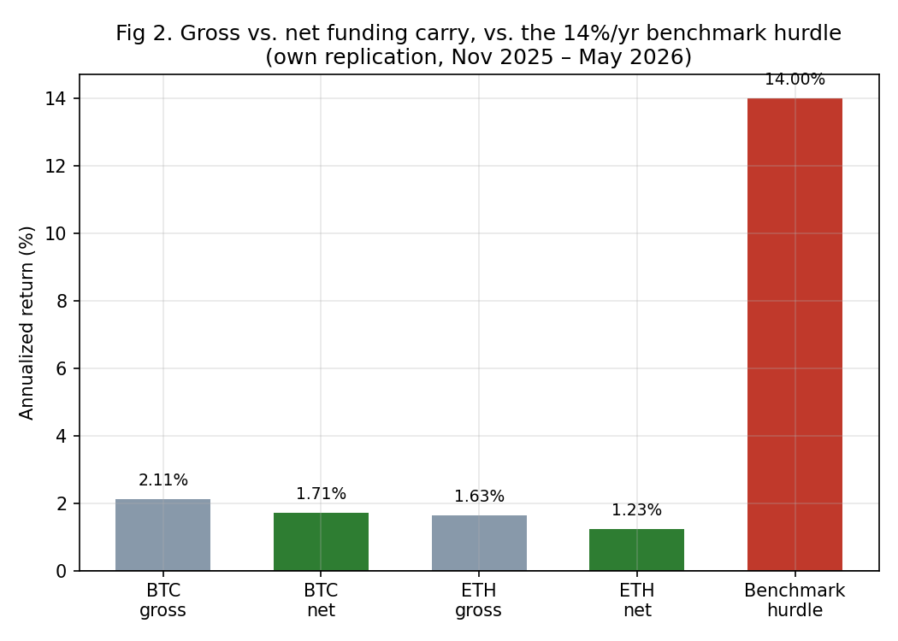

# 04 — Carry: A Real Edge I Wouldn't Trade

**Author:** Oleg Arefev
**Published:** August 2026
**Status:** `Published`
**Class:** Empirically tested (own replication on real Binance funding data, BTC/ETH, 636 8-hour periods) + Literature-based (second candidate implementation — fixed-date basis — closed on literature alone, before replication; see Section 7)

**Research question:** perpetual futures funding carry has genuine academic backing — a documented, economically explained inefficiency, not a mined pattern. Does it still clear a realistic capital-cost hurdle when measured on real, recent Binance data, or does an edge that is statistically and economically real in the literature turn out to be too small to bother trading once it's actually measured?

---

## 1. Why Carry Looked Promising

Carry is a different kind of candidate than the first three notes in this series. Grid's positive backtests came with unresolved capital-accounting and fill-model questions. Cross-sectional momentum's published spread turned out to be a genuinely marginal number that costs erased. Time-series trend's positive evidence belonged to a market regime that no longer exists. Perpetual funding carry, by contrast, arrives with an explained economic mechanism, multiple independent confirmations, and reported Sharpe ratios large enough that dismissing the idea outright, without checking it, would have been the wrong call.

He, Manela, Ross, and von Wachter (2024), in "Fundamentals of Perpetual Futures," derive no-arbitrage bounds for perpetual futures pricing and find that an implied arbitrage strategy — long spot, short the perpetual, collecting the funding rate — generates a Sharpe ratio of 1.80 for Bitcoin even after accounting for realistic trading costs. Christin, Routledge, Soska, and Zetlin-Jones (2022), in "The Crypto Carry Trade," independently studying the same underlying trade on a major exchange, report in-sample annual Sharpe ratios "in the range of 7 to 10" — figures large enough that the paper's own framing treats the trade's profitability as a puzzle requiring an economic explanation, not simply a headline result. Schmeling, Schrimpf, and Todorov (2025), in "Crypto Carry," a BIS-affiliated study, document that crypto carry can exceed 40% per annum at times and averages roughly 7% per year on a fixed-date basis — about ten times the equivalent measure in traditional G10 currency carry.

This is the kind of convergence this series looks for before opening a lab: three separate research teams, different data windows, different exact constructions, all finding the same thing — a real, economically explained, and historically large source of return from holding the "carry" side of crypto's perpetual futures market.

## 2. What Perpetual Funding Carry Actually Is

Perpetual futures don't expire, so they can't rely on convergence to spot at a fixed maturity date the way traditional futures do. To keep the perpetual's price tethered to spot, exchanges built in a mechanism: every funding interval (eight hours, on Binance), whichever side of the market is push- ing the perpetual's price away from spot pays the other side a funding rate proportional to that gap. When the perpetual trades above spot — the more common condition in a market with persistent net-long, leveraged retail demand — longs pay shorts.

The carry trade harvests this payment while staying market-neutral: go short the perpetual and simultaneously long the equivalent notional in spot (or a fixed-maturity future), so that price moves in the underlying largely net out between the two legs, and what's left is the periodic funding payment. In principle, this converts a payment mechanism designed to keep two prices in line into an income stream for whoever is willing to hold the short side of that spread.

## 3. Why the Literature Itself Flags a Fading Effect

All three papers above, independently, document the same underlying story: this is a real, structurally explained edge — and one that has been shrinking.

He, Manela, Ross, and von Wachter find that price deviations between perpetuals and spot — the very deviations the funding rate is designed to correct, and the source of the carry trade's return — "diminish over time," declining on average about 11% a year, consistent with an increase in arbitrage capital gradually closing the gap they're trying to exploit.

Christin, Routledge, Soska, and Zetlin-Jones trace a large part of the trade's profitability directly to retail leverage availability, and document a clean before/after break: on July 23, 2021, Binance reduced its maximum leverage from 125x to 50x (along with stricter limits for new accounts). The paper reports that in the lower-leverage era that followed, average funding-driven returns were substantially lower, driven by structurally smaller funding rates — direct evidence that a large share of the trade's historical profitability came from a specific market-structure condition (very high retail leverage) that has since been partially regulated away.

Schmeling, Schrimpf, and Todorov go further and establish a causal link using a difference-in-differences design around a specific event: the launch of the first U.S. spot Bitcoin ETF in January 2024. Because that ETF gave institutional arbitrageurs on the CME an easier way to hold spot Bitcoin as a hedge against futures positions, its introduction should — and, the authors find, did — measurably shrink the carry available to be captured. Their DiD estimate shows the ETF's launch decreased the futures-spot basis by about 3 percentage points across exchanges generally and by an additional 5 points specifically on the CME — declines the authors describe as "very large," corresponding to about 36% and 97% of the pre-event mean basis, respectively.

None of these three findings, on its own, closes the hypothesis — a documented long-run decline doesn't mean the strategy is unprofitable today, only that it's likely smaller than its historical average. That's exactly why this project didn't stop at the literature stage for Carry the way it did for Trend: the literature says the effect has been shrinking, not that it has reached zero, and only a direct measurement on current data can tell which is true right now.

## 4. This Project's Own Replication: Real Binance Funding Data, November 2025 – May 2026

This is where Carry departs from Grid and Trend and follows the same discipline as Momentum: an internal lab (`lab_03_bot1_oi_funding_price_divergence`) had already downloaded real, unmodified Binance funding-rate history for BTCUSDT and ETHUSDT — 636 eight-hour funding periods per coin, spanning November 2025 through May 2026, the most recent window available locally. Rather than accept a prior summary of that data at face value, we re-extracted the raw funding-rate files ourselves and recomputed every figure below directly, independent of any earlier calculation.

Annualizing each 8-hour funding print (rate × 3 periods per day × 365 days) and taking simple descriptive statistics across the full window:

| | BTC | ETH |
|---|---|---|
| Periods | 636 | 636 |
| Mean (annualized) | +2.11%/year | +1.63%/year |
| Median (annualized) | +2.84%/year | +2.62%/year |
| Maximum (annualized) | +10.95%/year | +10.95%/year |
| Minimum (annualized) | −16.62%/year | −40.00%/year |
| Share of periods negative | 32.5% | 33.3% |

A few things stand out. First, the maximum annualized rate observed anywhere in either coin's 636 periods was 10.95% — the strategy never once touched a rate that would, on its own, clear a 14%-per-year hurdle (Section 6), let alone sustain it. Second, funding was negative — meaning a short-carry position would have been paying, not collecting — for roughly a third of all observed periods on both coins, consistent with what the literature above frames as a genuinely two-sided, non-guaranteed payment, not a one-way subsidy.

Third, the distribution of individual 8-hour observations makes the same point another way — the mass of outcomes sits well under the hurdle line on both sides of zero, and the rare large-positive prints (near +11%/year) are no more frequent than the large-negative ones:

Fourth, the regime is not stable even within this seven-month window. Breaking the sample down by month:

| Month | BTC (annualized) | ETH (annualized) |
|---|---|---|
| Nov 2025 | +5.4% | +5.2% |
| Dec 2025 | +5.0% | +4.2% |
| Jan 2026 | +5.4% | +4.8% |
| Feb 2026 | −0.8% | −4.0% |
| Mar 2026 | −1.1% | −1.1% |
| Apr 2026 | −2.2% | −1.6% |
| May 2026 | +2.7% | +3.4% |

The regime shifted twice inside a seven-month window: a firmly positive stretch through January 2026, three consecutive negative months, and then a partial rebound in May. It's worth being precise about what this does and doesn't establish: the rebound means the effect isn't in a one-way, monotonic decline toward permanent negativity — but even at its best month in this table (November 2025, +5.4% for BTC), the observed rate is still well under half of the hurdle this note applies in Section 6. Regime instability here works in both directions, and neither direction gets close to the bar that matters.

## 5. Net of Costs, Using This Series' Own Cost Convention

Consistent with the methodology that produced Momentum's (Part II) net-of-costs figures, we apply a Binance USDⓈ-M taker fee of 0.05% per side plus an assumed 0.05% per side of slippage — the same fixed-before-the-fact cost assumption used in that note, not a number tuned to this result. A funding-carry position requires two legs (a spot leg and a perpetual leg) opened once and closed once over the measurement window, which comes to the same round-trip total used in Part II: 0.40 percentage points, applied here as a flat annualized haircut on the gross figure, consistent with treating cost as a recurring cost of maintaining and eventually unwinding the position rather than a one-time expense that shrinks toward zero the longer a position is held indefinitely.

| | BTC gross | BTC net | ETH gross | ETH net |
|---|---|---|---|---|
| Mean (annualized) | +2.11%/year | **+1.71%/year** | +1.63%/year | **+1.23%/year** |

Costs here are a much smaller share of the gross figure than they were for cross-sectional momentum's weekly-rebalanced basket (roughly 19% of gross for BTC, versus about 70% for the momentum spread in Part II) — funding carry, held rather than rebalanced weekly, is structurally less cost-sensitive. That's a genuine point in this strategy's favor relative to Momentum, and it's worth stating plainly rather than glossing over: on a pure costs-erode-everything basis, Carry does noticeably better than Momentum did. It just starts, and ends, at a much lower gross number than the benchmark this project applies to any candidate (Section 6).

## 6. The Benchmark Hurdle: 14% a Year, and Why the Gap Isn't Close

Positive net-of-costs isn't the bar this project applies — the third methodology check (Section on methodology, repository README) asks whether a strategy beats the best available alternative use of the same capital, given the risk and effort involved. For Carry specifically, the project fixed this alternative in advance, before looking at the replication numbers: a realistic crypto-lending/borrowing rate available to a retail-sized account (on the order of 50,000+ USDT), roughly 14% per year (quoted, in the specific reference used, as about 3.5% per 90-day term). This is a stated project convention, not a number drawn from an academic paper — it reflects a real, currently available alternative use of capital rather than a textbook risk-free rate, and it should be re-checked against current lending rates whenever this note is revisited, the same way this series re-checks Binance's fee schedule.

Against that 14%/year hurdle, the net figures from Section 5 aren't marginally short — they're roughly an order of magnitude below it. BTC's best net-of-costs figure (+1.71%/year) is about an eighth of the hurdle; ETH's (+1.23%/year) is smaller still. Even the single best individual monthly observation across the entire 636-period sample (BTC, November 2025, +5.4% annualized, before costs) would need to nearly triple, and hold at that level continuously, to clear the bar — and the sample's own regime instability (Section 4) shows exactly the opposite pattern: three consecutive months of negative funding followed the best stretch, not a continuation of it.

This is a different, and in some ways more interesting, kind of failure than the ones in the first three notes. Grid's problem was an inaccessible fee tier; Momentum's was costs consuming a marginal spread; Trend's was a regime that no longer exists. Carry's problem is neither of those: the edge is real, it's been measured directly on current data, it clears costs comfortably — and it's simply too small, relative to the opportunity cost of the capital required to run it, to be worth the operational complexity of a hedged, two-legged, continuously-monitored position.

## 7. The Second Candidate: Fixed-Date Basis, Closed on Literature Alone

This series tests at most two independently published implementations per hypothesis class before closing it. For Carry, the second literature-backed candidate is the fixed-date futures basis trade studied by Schmeling, Schrimpf, and Todorov — buying spot and selling a dated (rather than perpetual) futures contract to capture the basis directly, without relying on the funding-rate mechanism at all.

We did not build a separate replication lab for this variant, and it's worth being explicit about why, using the same logic this series applied to Trend's second candidate (Part III): the paper's own reported average for this construction is roughly 7% per year — already below this note's 14%/year hurdle at the literature's own central estimate, before any of our own cost adjustments or the paper's own documented ETF-driven compression (Section 3) are even applied. Running an independent replication to confirm a number that starts below the bar even in its most favorable, unadjusted, literature-reported form would be the same category of unnecessary work this series avoided for Trend's 2,500-coin robustness check — a result close enough to a known negative that a full replication effort isn't a productive use of this project's resources. The fixed-date basis candidate is closed at the literature stage, not because it was ever tested and failed on our own numbers, but because the published number it would need to beat our own funding-harvest result on already starts under the hurdle it would need to clear.

This is the one respect in which Carry's classification is a hybrid: the primary implementation (perpetual funding harvest, BTC/ETH) is Empirically tested — our own data, our own numbers, our own verdict against a pre-registered hurdle. The secondary implementation (fixed-date basis) is Literature-based — closed on the published evidence alone, the same way this entire hypothesis class would have been closed if the primary implementation's literature review, rather than its replication, had been decisive.

## 8. Verdict

Perpetual funding carry is not a strategy this series is closing because the effect isn't real, or because the literature is unconvincing, or because retail can't access the trade mechanically. It's closing because, measured honestly on real, recent Binance data for the two largest and most liquid perpetuals available, the net-of-costs return — +1.71%/year for BTC, +1.23%/year for ETH — falls roughly an order of magnitude short of a realistic, currently available alternative use of the same capital. The literature's own explanation for why this gap exists is coherent and, on the evidence reviewed in Section 3, well supported: arbitrage capital has grown, retail leverage has been curtailed by exchange policy, and institutional access to spot-hedging instruments (the 2024 ETF) has structurally reduced the very mispricing the trade is designed to capture. This project's own measurement is consistent with, not contradicted by, that story — the current numbers look like the tail end of a documented, multi-cause decline, not a data anomaly or a measurement error.

The second literature-backed implementation (fixed-date basis) doesn't get its own replication, for the same reason Trend's second candidate didn't: its own published, most favorable number already sits below the bar this project applies. With both permitted candidates addressed — one empirically, one at the literature stage — the Carry hypothesis class is closed, not to be reopened by a third variant "to save it."

## 9. What This Means for a Retail Trader

If you're comparing perpetual funding carry against simply lending the same capital at a realistic retail rate, the honest answer, on the data available at the time of writing, is: don't bother. The strategy isn't broken, isn't a mirage, and isn't secretly unprofitable after costs — on our own numbers it clears execution costs with room to spare. It's simply competing against an alternative that currently pays several times more, for a fraction of the operational complexity, monitoring burden, and liquidation risk that a continuously-hedged, two-legged perpetual carry position requires.

This is worth sitting with as a distinct failure mode from the other three notes in this series, because it's the one most likely to mislead a reader who stops at the academic papers and never runs the comparison against their own actual alternative. A Sharpe ratio of 1.80, or Sharpe ratios "in the range of 7 to 10," sound unambiguously attractive read in isolation — and they were, historically, genuinely large numbers. But a Sharpe ratio describes risk-adjusted consistency, not absolute size, and a small, consistent edge can still lose a straightforward comparison against a larger, simpler, more liquid alternative. The lesson generalizes beyond Carry specifically: before adopting any strategy on the strength of its Sharpe ratio, the question this series keeps returning to is the right one to ask first — compared to what, and is that comparison still true today, on your own numbers, not the paper's.

## References

- He, S., Manela, A., Ross, O., von Wachter, V. (2024). "Fundamentals of Perpetual Futures." arXiv:2212.06888 (first draft December 2022, this draft July 2024).
- Christin, N., Routledge, B. R., Soska, K., Zetlin-Jones, A. (2022). "The Crypto Carry Trade." Carnegie Mellon University, working paper, August 2022.
- Schmeling, M., Schrimpf, A., Todorov, K. (2025). "Crypto Carry." Bank for International Settlements / SSRN 4594813, version October 2025.

---

**Author:** Oleg Arefev
**Project:** [Searching for Edge](https://github.com/Silent47boryara/searching-for-edge)
**Repository:** [Silent47boryara/searching-for-edge](https://github.com/Silent47boryara/searching-for-edge)
