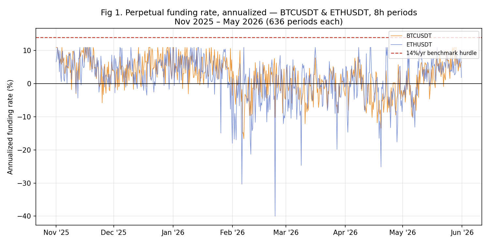
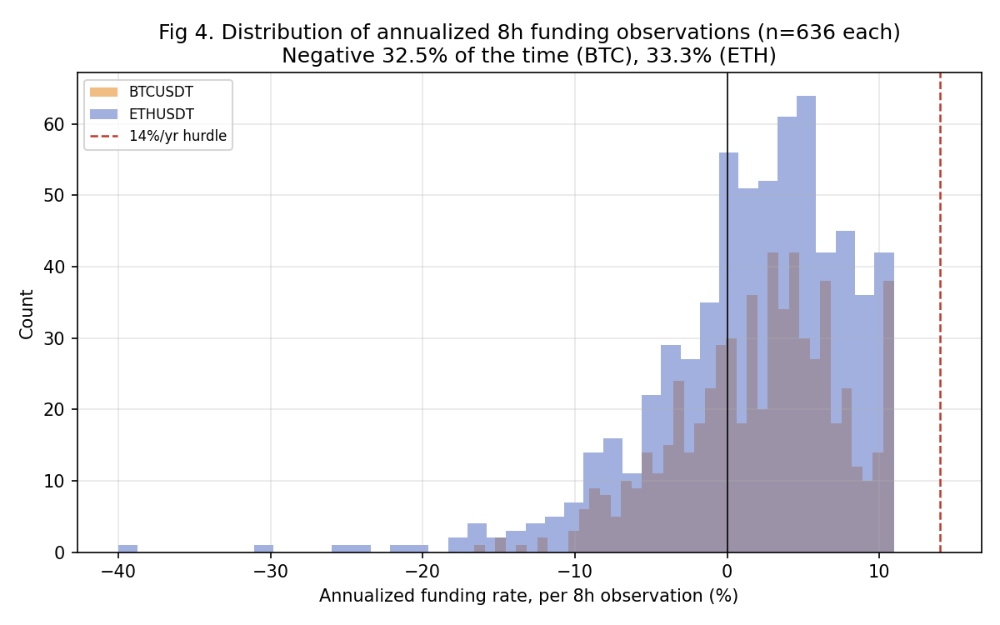
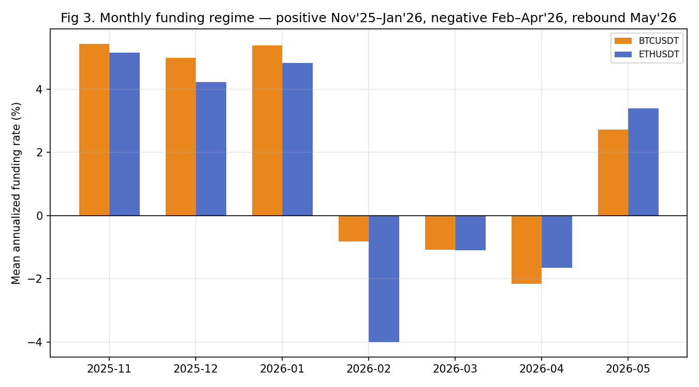

# 04 — Carry: A Real Edge I Wouldn't Trade

**Author:** Oleg Arefev
**Published:** August 2026
**Status:** `Published`
**Class:** Empirically tested (own measurement of real Binance BTC/ETH funding data, 636 8-hour periods each) + Literature-based (fixed-date basis closed on literature alone, before replication; see Section 7)

**Research question:** perpetual futures funding carry has genuine academic backing — a documented, economically explained inefficiency, not a mined pattern. Does it still clear a realistic capital-cost hurdle when measured on real, recent Binance data, or does an edge that is statistically and economically real in the literature turn out to be too small to bother trading once it's actually measured?

---

## 1. Why Carry Looked Promising

Carry is a different kind of candidate than the first three notes in this series. Grid's positive backtests came with unresolved capital-accounting and fill-model questions. Cross-sectional momentum's published spread turned out to be a genuinely marginal number that costs erased. Time-series trend's positive evidence belonged to a market regime that no longer exists. Perpetual funding carry, by contrast, arrives with an explained economic mechanism, multiple independent confirmations, and reported Sharpe ratios large enough that dismissing the idea outright, without checking it, would have been the wrong call.

He, Manela, Ross, and von Wachter, in "Fundamentals of Perpetual Futures" (working paper, last revised June 2025), derive no-arbitrage bounds for perpetual futures pricing and find that an implied arbitrage strategy — long spot, short the perpetual, collecting the funding rate — generates a Sharpe ratio of 1.80 for Bitcoin even after accounting for realistic trading costs. Christin, Routledge, Soska, and Zetlin-Jones (2022), in "The Crypto Carry Trade," independently studying the same underlying trade on a major exchange, report in-sample annual Sharpe ratios "in the range of 7 to 10" — figures large enough that the paper's own framing treats the trade's profitability as a puzzle requiring an economic explanation, not simply a headline result. Schmeling, Schrimpf, and Todorov (2026), in "Crypto Carry" — originally circulated as a BIS working paper, now published in Management Science — document that crypto carry can exceed 40% per annum at times and averages roughly 7% per year on a fixed-date basis — about ten times the equivalent measure in traditional G10 currency carry.

This is the kind of convergence this series looks for before opening a lab: three separate research teams, different data windows, different exact constructions, all finding the same thing — a real, economically explained, and historically large source of return from holding the "carry" side of crypto's perpetual futures market.

## 2. What Perpetual Funding Carry Actually Is

Perpetual futures don't expire, so they can't rely on convergence to spot at a fixed maturity date the way traditional futures do. To keep the perpetual's price tethered to spot, exchanges built in a mechanism: every funding interval (eight hours, on Binance), whichever side of the market is pushing the perpetual's price away from spot pays the other side a funding rate proportional to that gap. When the perpetual trades above spot — the more common condition in a market with persistent net-long, leveraged retail demand — longs pay shorts.

The carry trade harvests this payment while staying market-neutral: go short the perpetual and simultaneously long the equivalent notional in spot (or a fixed-maturity future), so that price moves in the underlying largely net out between the two legs, and what's left is the periodic funding payment. In principle, this converts a payment mechanism designed to keep two prices in line into an income stream for whoever is willing to hold the short side of that spread.

## 3. Why the Literature Itself Flags a Fading Effect

All three papers above, independently, document the same underlying story: this is a real, structurally explained edge — and one that has been shrinking.

He, Manela, Ross, and von Wachter find that price deviations between perpetuals and spot — the very deviations the funding rate is designed to correct, and the source of the carry trade's return — "diminish over time," declining on average about 11% a year, consistent with an increase in arbitrage capital gradually closing the gap they're trying to exploit.

Christin, Routledge, Soska, and Zetlin-Jones trace a large part of the trade's profitability directly to retail leverage availability, and document a clean before/after break: on July 23, 2021, Binance reduced its maximum leverage from 125x to 50x (along with stricter limits for new accounts). The paper reports that in the lower-leverage era that followed, average funding-driven returns were substantially lower, driven by structurally smaller funding rates — direct evidence that a large share of the trade's historical profitability came from a specific market-structure condition (very high retail leverage) that has since been partially regulated away.

Schmeling, Schrimpf, and Todorov go further and establish a causal link using a difference-in-differences design around a specific event: the launch of the first U.S. spot Bitcoin ETF in January 2024. Because that ETF gave institutional arbitrageurs on the CME an easier way to hold spot Bitcoin as a hedge against futures positions, its introduction should — and, the authors find, did — measurably shrink the carry available to be captured. Their DiD estimate shows the ETF's launch decreased the futures-spot basis by about 3 percentage points across exchanges generally and by an additional 5 points specifically on the CME — declines the authors describe as "very large," corresponding to about 36% and 97% of the pre-event mean basis, respectively.

None of these three findings, on its own, closes the hypothesis — a documented long-run decline doesn't mean the strategy is unprofitable today, only that it's likely smaller than its historical average. That's exactly why this project didn't stop at the literature stage for Carry the way it did for Trend: the literature says the effect has been shrinking, not that it has reached zero, and only a direct measurement on current data can tell which is true right now.

## 4. This Project's Own Measurement: Real Binance Funding Data, November 2025 – May 2026

This is where Carry departs from Grid and Trend and follows the same discipline as Momentum: an internal lab (`lab_03_bot1_oi_funding_price_divergence`) had already downloaded real, unmodified Binance funding-rate history for BTCUSDT and ETHUSDT — 636 eight-hour funding periods per coin, spanning November 2025 through May 2026, the most recent window available locally. Rather than accept a prior summary of that data at face value, we re-extracted the raw funding-rate files ourselves and recomputed every figure below directly, independent of any earlier calculation.

Annualizing each 8-hour funding print (rate × 3 periods per day × 365 days) and taking simple descriptive statistics across the full window:

| | BTC | ETH |
|---|---|---|
| Periods | 636 | 636 |
| Mean (annualized) | +2.11%/year | +1.63%/year |
| Median (annualized) | +2.84%/year | +2.62%/year |
| Maximum (annualized) | +10.95%/year | +10.95%/year |
| Minimum (annualized) | −16.62%/year | −40.00%/year |
| Share of periods negative | 32.5% | 33.3% |

A few things stand out. First, the maximum mechanically-annualized rate observed anywhere in either coin's 636 periods was 10.95%. No individual 8-hour funding observation in the sample, when mechanically annualized, exceeded the project's 14% annual hurdle — and this is a per-observation ceiling, not a realized annual return; no position was actually held for a full year at that rate. Second, funding was negative — meaning a short-carry position would have been paying, not collecting — for roughly a third of all observed periods on both coins, consistent with what the literature above frames as a genuinely two-sided, non-guaranteed payment, not a one-way subsidy.

Third, the distribution of individual 8-hour observations makes the same point another way — the mass of outcomes sits well under the hurdle line on both sides of zero, and the rare large-positive prints (near +11%/year) are no more frequent than the large-negative ones:

Fourth, the regime is not stable even within this seven-month window. Breaking the sample down by month:

| Month | BTC (annualized) | ETH (annualized) |
|---|---|---|
| Nov 2025 | +5.4% | +5.2% |
| Dec 2025 | +5.0% | +4.2% |
| Jan 2026 | +5.4% | +4.8% |
| Feb 2026 | −0.8% | −4.0% |
| Mar 2026 | −1.1% | −1.1% |
| Apr 2026 | −2.2% | −1.6% |
| May 2026 | +2.7% | +3.4% |

The regime shifted twice inside a seven-month window: a firmly positive stretch through January 2026, three consecutive negative months, and then a partial rebound in May. It's worth being precise about what this does and doesn't establish: the rebound means the effect isn't in a one-way, monotonic decline toward permanent negativity — but even at its best month in this table (November 2025, +5.4% for BTC), the observed rate is still well under half of the hurdle this note applies in Section 6. Regime instability here works in both directions, and neither direction gets close to the bar that matters.

## 5. Costs Do Not Need to Decide This Result

Part II (Momentum) computed a defensible net-of-costs figure because that strategy's structure made the cost calculation tractable: a fixed weekly rebalance, a known number of round trips, a flat per-trade fee and slippage assumption applied to a fixed number of trades. A funding-carry position doesn't reduce to the same simple arithmetic. Turning the round-trip cost of opening and closing a two-legged position into an annualized haircut requires assumptions this dataset alone doesn't let us pin down responsibly: how long a position is actually held before being unwound, how often it's rebalanced or re-hedged, how the spot leg is executed and financed, and how margin is maintained on the perpetual leg through a funding regime that periodically turns negative (Section 4). Applying a flat percentage-point subtraction as if it were already an annualized cost — treating a single transaction's round-trip fee as equivalent to a full year of holding — would misstate what the number represents. We did not reconstruct those execution and turnover assumptions from the funding-rate dataset alone, so this note does not report a synthetic net-of-costs return for Carry.

More importantly, this note doesn't need one to reach its decision. The measured gross funding yield — +2.11%/year annualized for BTC and +1.63%/year for ETH (Section 4) — already falls far below both the project's 14% hurdle and the simpler contemporary alternatives discussed in Section 6, before any cost, execution, or turnover assumption is even introduced. Where Momentum's case rested on costs consuming most of a marginal gross spread, Carry's case doesn't need costs to make the argument: the gross number alone is roughly an order of magnitude short of the bar. Any execution costs would further reduce the funding component measured here. A full strategy return could also be affected by basis changes, financing, hedge maintenance, and the timing of entry and exit — none of which are reconstructed from this dataset.

## 6. The Benchmark Hurdle: A Deliberately Demanding, Openly Subjective Threshold

Positive net-of-costs isn't the bar this project applies — the fourth methodology check (repository README) asks whether a strategy beats the best available alternative use of the same capital, given the risk and effort involved. The idea of a hurdle is hardly novel: from Knight's (1921) distinction between risk and uncertainty to Markowitz's (1952) portfolio theory and Sharpe's (1964) risk-return framework, finance has long treated return as meaningful only relative to the risk and alternative use of capital required to obtain it. None of those frameworks determines what this project's hurdle should be. That number is a capital-allocation decision, not a theorem.

For Carry specifically, the project had already fixed a 14% annual hurdle before this measurement was run. It was not intended as a market risk-free rate or as a claim that every investor can earn 14% elsewhere. It was a project-level capital-allocation rule: below roughly that return, we did not consider an active crypto strategy sufficiently attractive to justify its additional exchange, execution, margin, and operational risks. It is not derived from an optimization, and this note does not claim it's the objectively correct hurdle for every reader — it's this project's own documented decision rule, fixed in advance and disclosed rather than tuned after seeing the result. A reader with a different risk tolerance, capital base, or set of accessible alternatives may reasonably set that bar lower, or higher — and should.

The point of naming alternative asset classes isn't to prove 14% is the right number — it's to explain why a hurdle exists at all, and why it isn't arbitrary even though this specific value is a project convention. Capital doesn't have to sit idle if Carry is rejected. Depending on jurisdiction and investor access, established alternatives include bank deposits and government securities, funds, real estate, private lending, and ordinary small-scale business activity — real estate flipping and short-term property management, mutual funds, peer-to-peer or crowdlending platforms, and commercial real estate among them, commonly advertising annualized returns in the high single digits to mid-teens depending on market, platform, and the risk actually taken on. None of those figures carry the same verification standard as the funding-rate numbers in Section 4 — they vary by country, product, and year, and this note doesn't try to pin a single "true" number on any of them the way it does for Binance's own data. The point isn't that every alternative reliably earns 14%; it's that an active, exchange-dependent crypto strategy has to offer enough incremental return to justify moving capital away from simpler, better-understood alternatives and accepting additional exchange, execution, margin, and strategy risk on top.

The most conservative end of that category is independently checkable, and worth stating precisely rather than gesturing at: as of August 2026, the best nationally available FDIC-insured US high-yield savings accounts and 12-month CDs pay in the range of roughly 4.0%–4.5% APY, carrying essentially none of a carry trade's exchange-counterparty risk, margin-management burden, or exposure to a funding regime that can turn negative (Section 4) — a boring, heavily regulated, single-leg product that already yields roughly double this note's own measured BTC gross funding rate.

Against the project's own 14%/year hurdle, the gross figures from Section 4 aren't marginally short — they're roughly an order of magnitude below it, with no cost adjustment needed to reach that conclusion (Section 5). BTC's gross figure (+2.11%/year) is roughly a seventh of the hurdle; ETH's (+1.63%/year) is smaller still, roughly a ninth. Even the single best individual monthly observation across the entire 636-period sample (BTC, November 2025, +5.4% annualized) would need to nearly triple, and hold at that level continuously, to clear the bar — and the sample's own regime instability (Section 4) shows exactly the opposite pattern: three consecutive months of negative funding followed the best stretch, not a continuation of it. And even against the far more conservative ~4.0%–4.5% savings-account comparison above, BTC's gross funding rate of +2.11%/year still falls short outright — again, before any cost or execution assumption is introduced.

There's a version of the classical risk-return logic above that many readers bring to crypto by default: crypto is high-risk, so it should be high-reward, funding carry included. That assumption had real grounding historically — Section 1's reported Sharpe ratios were extraordinary by any standard. What this note's own measurement shows is that, for this specific strategy, on this specific and recent window, the measured premium has compressed toward — and against the FDIC-insured comparison above, below — the reward available from an instrument carrying essentially none of the same risk. The theory isn't contradicted; the premium observed in our recent Binance funding sample is substantially smaller than the historical carry documented in the literature, consistent with the compression mechanisms identified by He, Christin, and Schmeling (Section 3).

This is a different, and in some ways more interesting, kind of failure than the ones in the first three notes. Grid's problem was an inaccessible fee tier; Momentum's was costs consuming a marginal spread; Trend's was a regime that no longer exists. Carry's problem is neither of those: the edge is real, it's been measured directly on current data — and it's simply too small, before any cost or execution question even needs to be asked, relative to the opportunity cost of the capital required to run it, to be worth the operational complexity of a hedged, two-legged, continuously-monitored position, next to alternatives that are older, simpler, and in the most conservative case, already better documented than the strategy itself.

## 7. The Second Candidate: Fixed-Date Basis, Closed on Literature Alone

This series tests at most two independently published implementations per hypothesis class before closing it. For Carry, the second literature-backed candidate is the fixed-date futures basis trade studied by Schmeling, Schrimpf, and Todorov — buying spot and selling a dated (rather than perpetual) futures contract to capture the basis directly, without relying on the funding-rate mechanism at all.

We did not build a separate replication lab for this variant, and it's worth being explicit about why, using the same logic this series applied to Trend's second candidate (Part III): the paper's own reported average for this construction is roughly 7% per year — already below this note's 14%/year hurdle at the literature's own central estimate, before the paper's own documented ETF-driven compression (Section 3) is even applied. Running an independent replication to confirm a number that starts below the bar even in its most favorable, unadjusted, literature-reported form would be the same category of unnecessary work this series avoided for Trend's 2,500-coin robustness check — a result close enough to a known negative that a full replication effort isn't a productive use of this project's resources. The fixed-date basis candidate is closed at the literature stage, not because it was ever tested and failed on our own numbers, but because the published number it would need to beat our own funding-measurement result on already starts under the hurdle it would need to clear.

This is the one respect in which Carry's classification is a hybrid: the primary component (perpetual funding measurement, BTC/ETH) is Empirically tested — our own data, our own numbers, measured directly against a pre-registered hurdle, without requiring a full net-of-costs strategy reconstruction (Section 5) to reach a verdict. The secondary implementation (fixed-date basis) is Literature-based — closed on the published evidence alone, the same way this entire hypothesis class would have been closed if the primary component's literature review, rather than its measurement, had been decisive.

## 8. Verdict

Carry wasn't falsified. It was priced out of this project's opportunity set. This project's own Binance data still show positive average funding — approximately +2.11%/year gross for BTC and +1.63%/year gross for ETH — so, in that narrow sense, the mechanism documented in the literature is still visible today, not merely a historical artifact.

Perpetual funding carry is not a strategy this series is closing because the effect isn't real, or because the literature is unconvincing, or because retail can't access the trade mechanically. It's closing because, measured honestly on real, recent Binance data for the two largest and most liquid perpetuals available, the gross funding yield — +2.11%/year for BTC, +1.63%/year for ETH — falls roughly an order of magnitude short of a realistic, currently available alternative use of the same capital, with no cost adjustment required to reach that conclusion (Section 5). The literature's own explanation for why this gap exists is coherent and, on the evidence reviewed in Section 3, well supported: arbitrage capital has grown, retail leverage has been curtailed by exchange policy, and institutional access to spot-hedging instruments (the 2024 ETF) has structurally reduced the very mispricing the trade is designed to capture. This project's own measurement is consistent with, not contradicted by, that story — the current numbers look like the tail end of a documented, multi-cause decline, not a data anomaly or a measurement error.

The second literature-backed implementation (fixed-date basis) doesn't get its own replication, for the same reason Trend's second candidate didn't: its own published, most favorable number already sits below the bar this project applies. With both permitted candidates addressed — one empirically, one at the literature stage — the Carry hypothesis class is closed, not to be reopened by a third variant "to save it."

## 9. What This Means for a Retail Trader

A retail trader doesn't evaluate a strategy against zero. The relevant comparison is the return available on the same capital without putting it into a leveraged, two-legged trading position at all — and that comparison depends on the trader: their country, their currency, their banking access, and what's actually open to them. This project fixed one specific figure (14%/year, Section 6) as its own working hurdle, but the broader point survives even for a reader whose realistic alternative looks nothing like that number. Someone with access to short-term property flipping or management, mutual funds, crowdlending platforms, or commercial real estate may see annualized returns bracketing the high single digits to the mid-teens, none of which require exchange counterparty exposure or continuous margin management. Someone with no access to any of that — just an ordinary FDIC-insured savings account or CD — was still looking at roughly 4.0%–4.5%/year as of August 2026 (Section 6), nearly double this note's own +2.11%/year BTC gross figure, with no cost adjustment needed to reach that comparison.

Put plainly: at roughly 2% gross, perpetual funding carry asks a trader to accept exchange risk, execution risk, periods of outright negative funding, active margin-management requirements, and the operational burden of maintaining two offsetting positions — for a return that a large share of retail traders can already match, or beat, by doing something closer to nothing. The strategy isn't broken and isn't a mirage — the gross edge is real and measured directly on current data (Section 4). It's simply competing, before any cost or execution-cost question even needs to be asked (Section 5), against alternatives, several of them decades older and far less operationally demanding, that currently pay as much or more.

A reader may reasonably disagree with the 14% hurdle specifically. That disagreement doesn't invalidate the measurement — it just means the conclusion to draw from it is a personal one, not a house one. Replace the hurdle with your own opportunity cost. At the time of this test, BTC funding produced approximately +2.11%/year annualized gross and ETH +1.63%/year. If those numbers clear your personal hurdle once you've accounted for the strategy's exchange, execution, and margin-management risk, Carry may still make sense for you. They did not clear ours.

This is worth sitting with as a distinct failure mode from the other three notes in this series, because it's the one most likely to mislead a reader who stops at the academic papers and never runs the comparison against their own actual alternative. A Sharpe ratio of 1.80, or Sharpe ratios "in the range of 7 to 10," sound unambiguously attractive read in isolation — and they were, historically, genuinely large numbers. But a Sharpe ratio describes risk-adjusted consistency, not absolute size, and a small, consistent edge can still lose a straightforward comparison against a larger, simpler, more liquid alternative. The lesson generalizes beyond Carry specifically: before adopting any strategy on the strength of its Sharpe ratio, the question this series keeps returning to is the right one to ask first — compared to what, and is that comparison still true today, on your own numbers, not the paper's.

Our conclusion is not that Carry is a bad strategy. It's that approximately 2% a year, before accounting for exchange, execution, and margin-management risk, is not enough for this project to trade it. If your hurdle is lower, your conclusion may be different — the data are in Section 4, unmodified; change the hurdle and make your own call.

None of this is financial advice, and none of the comparator figures above (real estate, funds, crowdlending, savings rates) are re-verified with the same rigor this note applies to its own Binance funding measurement — they change by country, platform, and year, and a reader should check current numbers for their own situation rather than treat any figure in this section as durable.

## References

- He, S., Manela, A., Ross, O., von Wachter, V. "Fundamentals of Perpetual Futures." arXiv:2212.06888 / SSRN 4301150. First posted December 2022; last revised June 2025 (working paper; under review at the Review of Financial Studies as of this note's publication).
- Christin, N., Routledge, B. R., Soska, K., Zetlin-Jones, A. (2022). "The Crypto Carry Trade." Carnegie Mellon University, working paper, August 2022.
- Schmeling, M., Schrimpf, A., Todorov, K. (2026). "Crypto Carry." *Management Science*, published online May 6, 2026, DOI: 10.1287/mnsc.2024.05069. (Originally circulated as BIS Working Paper No. 1087 / SSRN 4268371, first posted December 2022.)
- NerdWallet, "Best High-Yield Savings Accounts of August 2026" (accessed August 2026); Bankrate, "Best CD Rates of August 2026" (accessed August 2026) — used in Section 6 for the FDIC-insured savings/CD comparison.
- Knight, F. H. (1921). *Risk, Uncertainty, and Profit*. Houghton Mifflin.
- Markowitz, H. (1952). "Portfolio Selection." *The Journal of Finance*, 7(1), 77–91.
- Sharpe, W. F. (1964). "Capital Asset Prices: A Theory of Market Equilibrium under Conditions of Risk." *The Journal of Finance*, 19(3), 425–442.

---

**Author:** Oleg Arefev
**Project:** [Searching for Edge](https://github.com/Silent47boryara/searching-for-edge)
**Repository:** [Silent47boryara/searching-for-edge](https://github.com/Silent47boryara/searching-for-edge)
