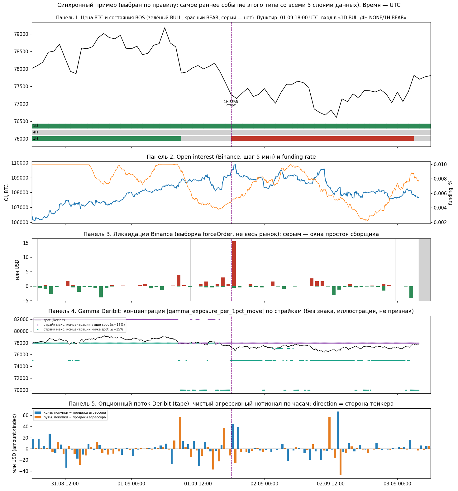

# BTC BOS × деривативы — Фаза 1, первый результат (аудит, единицы наблюдения, схема join)

Дата: 2026-10-07. Статус: **первый результат; остановка до ревью**. Фаза 2 (атрибуция) не запускалась, гипотез не проверялось, порогов не подбиралось, `bot_v2.py` не менялся.
Все времена в UTC. Логи сборщиков в МСК (UTC+3), переведены; колонка `Time` в логе бота — UTC (проверено по mtime файла).

## 0. Вердикт

**Данных недостаточно (расчёт атрибуции не запускался и на этих данных не даст вывода).** Причины, по убыванию значимости:

1. **Независимых режимов 1D почти нет.** В окне общих данных (с 2026‑08‑29 11:28 UTC) на 1D всего **2 BULL‑эпизода**, оба в одном направлении; один начался до окна (лево‑цензурирован), второй ещё идёт (право‑цензурирован). BEAR на 1D нет вообще. По правилу N<10 кластеров любая ячейка, зависящая от 1D, — `INSUFFICIENT SAMPLE`.
2. **Вложенность.** 4H‑эпизодов в окне 6, 1H‑эпизодов 17, но все они лежат внутри 2–3 режимов 1D. Увеличивать N за счёт вложенных наблюдений нельзя.
3. **Полнота производных данных на моментах событий:** все пять слоёв одновременно доступны лишь для 11 из 25 стартов эпизодов и для 23 из 43 мульти‑ТФ переходов.
4. **Общие простои машины** (≈7–8% времени) выбивают все потоки одновременно.

Это допустимый результат фазы 1: «пока недостаточно независимых рыночных режимов, чтобы ответить на вопрос».

## 1. Найденные файлы

| Набор | Файл | Объём | Примечание |
|---|---|---|---|
| BOS, исходный код | `bot_v2.py` | 1374 строки, sha256 `b1f4eaa37187cb2917b92471c4dff9f71ecd88e6e3c4d0e539b8cf7abaa996c8` | mtime 2026‑08‑25 17:21; текущий процесс (PID 89821) запущен 2026‑09‑12 11:46, позже изменения файла — одна и та же логика с 25.08 |
| BOS, боевой лог | `btc_signals_log(*)_v4.csv` | 48 файлов, 1987 строк, 2026‑08‑21 → 2026‑10‑07 | лог пишется каждый тик ~30 мин |
| Цена (новое) | `LAB_attrib_p1/raw/BTCUSDT_{1d,4h,1h}_binance_raw.csv` | 644 / 1136 / 2745 свечей | Binance spot `/api/v3/klines`, загружено 2026‑10‑07 09:33 UTC, только закрытые, дыр 0, файлы только для чтения (sha256: 1d `f1fcbd1e…`, 4h `f43d66ee…`, 1h `258e784e…`) |
| Цена (старое) | `BTCUSDT_1h_history_full.csv` и др. | кончаются 20.08 / 28.08, 4H нет | не использованы, не изменены |
| OI | `oi_raw.csv` | 10 423 | Binance, символ BTCUSDT |
| funding/mark | `funding_markprice_raw.csv` | 3 123 108 | ~1 строка/с |
| ликвидации | `liquidations_raw.csv` | 34 026 | Binance forceOrder, выборка |
| gamma | `gamma_snapshot_agg.csv` / `gamma_snapshot_raw.csv` | 6 525 / 2 527 713 | Deribit BTC |
| options tape | `deribit_option_trades_raw.csv` + `deribit_trade_tape_cursor.json` | 246 190 | Deribit |
| Бэкфиллы (не использованы) | `oi_history_backfill_30d.csv` (8 928), `funding_rate_history_backfill.csv` (500) | | OI‑бэкфилл за 30 дней мог бы закрыть дыры OI — см. §9 |
| Логи сборщиков | `liq_collector.log`, `funding_oi_collector.log`, `gamma_collector.log`, `deribit_trade_tape_collector.log(.1–.3)` | | используются только как свидетельство работы, не как замена timestamp |

Код и промежуточные результаты: `LAB_attrib_p1/scripts/01…12_*.py`, `LAB_attrib_p1/out/`. BOS‑код извлечён из `bot_v2.py` дословно по AST (импорт модуля не использовался: он включает `logging.basicConfig` в боевой `bot_errors.log`); в извлечённом файле нет секретов, хеш исходника записан в заголовке `scripts/bot_v2_extracted.py`.

## 2. Отчёт о покрытии и дырах (по реальным timestamp)

| Поток | Первая — последняя запись | N | Ожидаемая частота | Покрытие | Дубли | Дыр > порога | Крупнейшая дыра |
|---|---|---|---|---|---|---|---|
| OI | 08‑28 21:05 → 10‑07 09:35 | 10 423 | 5 мин | **91,5%** слотов | 13 строк в слоте | 38 (>15 мин) | 9 ч 10 мин (23.09) |
| funding/mark | 08‑29 11:28 → 10‑07 09:36 | 3 123 108 | ~1 с | **92,0%** секунд | 0 (по event_time_ms) | 99 (>60 с), 36 (>10 мин) | 8 ч 18 мин (до 21.09 07:52) |
| gamma_agg | 08‑24 19:44 → 10‑07 09:30 | 6 525 | 10 мин | 82,1% (**91,6%** без известной дыры) | 1 373 слотов с 2+ строками | 67 (>15 мин) | **109 ч** (02.10 10:10 → 06.10 23:10) |
| лог бота | 08‑21 19:34 → 10‑07 09:27 | 1 987 | ~30 мин | ~88,8% | 0 | 36 (>75 мин) | 12 ч 36 мин (23.09) |
| ликвидации | 08‑29 11:41 → 10‑07 09:35 | 34 026 | событийный | **92,6%** времени валидно по маске | 0 | 170 окон простоя | см. §7 |
| tape | 08‑28 21:27 → 10‑07 09:36 | 246 190 | событийный | см. §7 | 0 | 2 дыры >1 ч | 7 ч 53 мин (05.10) |
| свечи 1d/4h/1h | — | 644/1136/2745 | — | 100% | 0 | 0 | — |

Год везде 2026 (проверено `assert`). Замечено: часть строк с нулевыми микросекундами без дроби (`…+00:00`), из‑за чего наивный `pd.to_datetime` падает; использован `format="ISO8601"`.

**Общие простои.** Все крупные окна funding ≥30 мин (топ‑25 в `out/common_outages.csv`) совпадают по времени с дырами OI, gamma и лога бота: 20–21.09 (8,3 ч), 12.09 (6,7 ч), 03.09 (4,7 ч), 16.09, 15.09, 19.09 и др. Это сбои машины/сети, а не отдельных сборщиков. **Сеть 12.09** разобрана отдельно: 01:54–08:38 UTC (6,7 ч) и ещё три окна позже в тот же день (10:01–11:23, 11:52–15:03, 15:03–16:43) — все потоки и бот.

Неустранимые дыры не интерполировались.

## 3. Независимые эпизоды BOS (replay)

Replay воспроизводит то, что видел бы бот в каждый тик после закрытия бара, окно 499 закрытых + 1 формирующийся бар, `compute_impulse(closed_only=True)`, дословный код. **Сверка с боевым логом:** 1D 100,0%, 4H 98,9%, 1H 99,1%; 40 расхождений из 5 961 пар «тик×ТФ», все — в логе `NONE`, в replay `ACTIVE`/`ENDED`, все после 13.09 (§9, п.7).

| ТФ | Эпизодов, пересекающих окно | BULL / BEAR | Завершены | Активны сейчас | Цензурированы слева |
|---|---|---|---|---|---|
| 1D | **2** | 2 / 0 | 1 (по пивоту) | 1 | 1 |
| 4H | 6 | 4 / 2 | 6 (по пивоту) | 0 | 0 |
| 1H | 17 | 8 / 9 | 16 (15 по пивоту, 1 по противоположному BOS) | 1 | 0 |

Эпизоды 1D: BULL с 2026‑08‑19 до 2026‑09‑15 (лево‑цензурирован, возраст 26 баров), BULL с 2026‑09‑18 по сегодня (18 баров, право‑цензурирован). Между ними 1D неактивен ~3 суток.

## 4. Структурные переходы

Состояние ТФ = ACTIVE‑направление или `NONE` (`ENDED` и `NONE` объединены: «нет активного импульса»).

| Переход | 1D | 4H | 1H |
|---|---|---|---|
| NONE→BULL | 1 | 3 | 8 |
| NONE→BEAR | 0 | 2 | 7 |
| BULL→NONE | 1 | 4 | 7 |
| BEAR→NONE | 0 | 2 | 8 |
| BULL→BEAR (противоп. BOS) | 0 | 0 | 1 |
| BEAR→BULL | 0 | 0 | 0 |

**Мульти‑ТФ.** На сетке закрытий 1H в окне 12 различных состояний, 44 сегмента, **43 перехода**; медиана длительности сегмента 18 ч. Наиболее частые (часов): `1D BULL/4H BULL/1H NONE` 178, `1D BULL/4H NONE/1H BEAR` 177, `1D BULL/4H BULL/1H BULL` 169, `1D BULL/4H NONE/1H NONE` 137. `1D NONE` лишь 72 ч суммарно. Таблица заходов — `out/multi_tf_segments.csv`.

**Цепочка из задания** `1D BULL / 4H NONE / 1H BEAR`: **7 заходов** (из `…4H NONE/1H NONE` — 5, из `…4H BULL/1H BEAR` — 2), медианная длительность 17 ч, макс 61 ч; заходы распределены по двум 1D‑режимам: **4** в первом BULL‑эпизоде (01.09, 07.09, 09.09, 15.09) и **3** во втором (24.09, 28.09, 07.10). То есть независимых кластеров 2, а не 7. `1D BULL/4H NONE/1H BEAR` против `1D BULL/4H BULL/1H BEAR`: второе состояние встречается лишь 3 раза, медиана 3 ч.

## 5. Единица наблюдения

- **A. Эпизод BOS.** Ключ `(tf, direction, start_bar_open)`. Момент решения `T` = закрытие бара BOS (первый тик с `ACTIVE`). Конец — закрытие бара, когда сработал пивот‑слом или противоположный BOS. Не завершённые эпизоды помечаются как право‑цензурированные (`ended_observed=False`).
- **B. Структурный переход.** Смена вектора `(1D, 4H, 1H)` на сетке закрытий 1H; `T` = закрытие 1H‑бара, в котором вектор изменился.
- **Кластер для неопределённости:** 1D‑эпизод (режим) как верхний уровень; 4H‑ и 1H‑эпизоды вложены. Тики по 30 минут независимыми не считаются.
- Строки лога бота как единица не используются.

## 6. Предлагаемая причинная схема join

Для события в момент `T` (закрытие бара) признак берётся только из записей с `timestamp ≤ T`; ближайшее будущее значение не используется; устаревшее значение → `MISSING`, а не forward‑fill.

| Слой | Время записи | Правило свежести | Дополнительное условие валидности |
|---|---|---|---|
| OI | `recv_ts_utc` | ≤ 15 мин | слот не в дыре |
| funding | `recv_ts_utc` | ≤ 60 с | — |
| gamma | `snapshot_ts_utc` (слот 10 мин, дедуп по слоту) | ≤ 20 мин | только сегмент до 2026‑10‑02 10:10; сегмент после 10‑06 23:10 пока слишком короток |
| ликвидации | `recv_ts_utc` (задержка к `event_time_ms` медиана 0,07 с) | событие при валидном окне | маска валидности (§7); для окна признака `[T‑24ч,T]` покрытие маски ≥ 90% |
| tape | `timestamp_ms` сделки | сделка с `trade_time ≤ T` | вне окна исключения ±24 ч (§7) |

Признаки направленно нормализуются: `s = +1` для BULL, `−1` для BEAR; BULL и BEAR всегда показываются отдельно и затем объединённо. Нормализация gamma на состав цепочки (экспирации меняют `n`: 430→376) допускается без модели знакового GEX.

**Исходы (определены заранее).** `P(T)` — закрытие бара BOS (исполнение и издержки не моделируются). Для `h ∈ {1,4,12,24}` ч (и 48, 72 при достаточной выборке): `R_h = s·(P(T+h)/P(T) − 1)`; MFE/MAE — по high/low 1H‑баров в `(T, T+h]`, направленно нормализованные; continuation = `R_h > 0`, reversal = `R_h < 0`, `R_h = 0` — в оба класса не входит и считается отдельно; время до следующего перехода — кривая Каплана–Мейера с правой цензурой на 2026‑10‑07. `level_lost_5d` — **определение не найдено в файлах** (§9, п.1).

## 7. Исключённые периоды и маски

| Что | Период / правило | Почему |
|---|---|---|
| gamma | 2026‑10‑02 10:10 → 2026‑10‑06 23:10 | известная неустранимая дыра (маршрут Deribit через VPN); пост‑сегмент короче суток |
| ликвидации до запуска | всё до 2026‑08‑29 11:28:12 | первая сессия (с 28.08) подключалась к `/ws/btcusdt@forceOrder`, 15 ч `events=0`, при этом heartbeat писал «тишина в потоке — соединение живо»; с 29.08 14:28 МСК endpoint `/market/ws/…` |
| ликвидации: простои | 170 окон, 68,9 ч (7,4% времени): от ошибки соединения до `Подключено.` ∪ пропуск heartbeat >15 мин | порог 15 мин выбран по распределению (99,5% интервалов ≤12,4 мин), устойчив при 10–30 мин; **приёмка:** внутри невалидных окон лишь 74 из 34 026 событий (0,22%); 63,3 из 67,4 ч окон ≥10 мин совпадают с дырами funding |
| tape: подтверждённые дыры | 05.10 03:22–10:17 и 14:44–22:37 | паузы 7–8 ч при максимуме 59 мин в остальное время |
| tape: консервативное исключение | **2026‑10‑02 00:00 → 2026‑10‑06 23:05** (+24 ч к окну признака) | лаг записи вырос до 17–24 ч, API Deribit, по проверке одного эндпоинта, не отдаёт историю старше примерно суток (срок точно не измерялся); 10‑06 23:05 — пакетная дозапись +166 строк |
| бот/replay во время простоев | не исключаются | BOS строится по свечам Binance и не зависит от простоев машины, но деривативные признаки в эти часы `MISSING` |

**Поправка к моему прошлому сообщению:** я писал, что 3–5 октября сделок «втрое меньше нормы». 3–4 октября — суббота и воскресенье; в чистые выходные (29–30.08, 05–06.09, 12–13.09, 19–20.09, 26–27.09) число сделок 2 123–4 699 в сутки, 3 и 4 октября дали 2 187 и 2 242 — внутри этого диапазона. Достоверно потеряны только два окна 5 октября. Правило «час ниже минимума всех чистых недель для ячейки день×час» пометило 53 часа за 2–6.10 при ожидаемых по случайности ~20 (грубая оценка 1/(n+1) на час), то есть деградация есть, но по часам не локализуется. Исключение 2.10–6.10 — осознанно консервативное.

## 8. Пример синхронного графика

**Правило выбора (задано до просмотра):** самое раннее событие входа в `1D BULL / 4H NONE / 1H BEAR`, у которого доступны все пять слоёв по `out/event_availability.csv` — **2026‑09‑01 18:00 UTC**. Это один пример без доказательной силы.
Что на нём видно (наблюдение, не вывод): в час *до* момента события ликвидации лонгов 0,73 млн USD (46 событий), в час *после* — 15,45 млн USD (216 событий), то есть всплеск следует за BOS, а не предшествует ему. Панель gamma — иллюстрация (страйк максимума `|gamma_exposure_per_1pct_move|` выше/ниже spot), не определение признака.

## 9. Методологические и данные‑проблемы

1. **`level_lost_5d` не определён в файлах.** В HANDOFF §4.2 и `Claude outputs/` есть только формулировка «удержан ли уровень к 5‑му дню (38% против 94%)» без точного уровня (уровень BOS? уровень слома?), без правила (закрытие на 5‑й день или любое закрытие за 5 дней) и без кода. Я его **не переопределял и не считал**. Нужен точный источник/определение от владельца.
2. **Heartbeat «соединение живо» не доказывает доставку событий** (случай 28–29.08, см. §7). Для ликвидаций нужна маска по ошибкам + интервалам heartbeat + самим событиям.
3. **Heartbeat не ровно 5 мин:** 8 606 интервалов ≤10 мин, 26 интервалов >30 мин. Первая версия маски с порогом 7 мин ошибочно считала простоем 36% времени (31% событий попало в «невалидные» окна). Исправлено, приёмочный тест описан в §7; v1‑файлы переименованы `_SUPERSEDED_v1_*`.
4. **Два экземпляра gamma** с 12.09 по 06.10 писали в одни файлы: 1 373 слота с дублями, при анализе — дедуп по слоту. Расхождение значений внутри дублей не сравнивалось.
5. **Общая причина простоев** машины/сети; вся статистика покрытия коррелирована, потоки не независимы.
6. **Tape:** `trade_id` не монотонен по времени сделок (глобальный счётчик Deribit, пакетная дозапись) — не использовать как порядок. Надёжность tape до 02.10 проверена только правилом «день×час» и по крупным дырам; дни с большим числом предупреждений в логе (12.09, 15.09, 19–24.09) отдельно не разбирались.
7. **Лог бота ненадёжен как запись структуры:** в 40 тиках `NONE`, а replay показывает `ACTIVE`/`ENDED`. Причина **не проверена**; гипотеза — неполный ответ API (код возвращает пустой DataFrame без записи в лог). Replay принят как основной источник.
8. **BOS не «чистая структура»:** `_detect_swings` фильтрует свинги по EMA50, ATR и объёму (`High−EMA50 > 0.7·ATR`, `Volume > 1.05·MA20`). Определения не менялись; игнорирование объёма относится только к остальным слоям бота.
9. **Режим цены:** 5–6 недель, эпизоды 1D только BULL; результат не переносится на BEAR/другие режимы.
10. **Gamma‑объём:** сырой файл 2,5 млн строк; концентрации зависят от недельных экспираций (число инструментов 430→376) — нормировка нужна до использования.
11. **Грубая оценка времени до N=10 кластеров** (Пуассон по наблюдаемой частоте, зависит от режима): при кластеризации по 1D — порядка 200–400 суток; по 4H (6 за ~39 дней) — ещё ~4 недели; по 1H кластеров 17, но все вложены в 2–3 режима 1D. Выбор уровня кластеризации — решение владельца.
12. **Что можно сделать независимо от деривативов:** BOS‑baseline (§4 ТЗ) на длинной истории свечей Binance (4,5 года, 72 дневных BOS по HANDOFF) — ответит на «что BOS сам говорит», но не на вопрос про деривативы.
13. **Безопасность (P0):** в `bot_v2.py` и в `bot_errors.log` (уровень DEBUG пишет полный URL Telegram) лежат токен бота; в `bot_v2.py` лежат также ключи Binance API. Значения в отчёт не включены. Отдельная рекомендация: `../SECURITY_RECOMMENDATION_secrets_in_logs.md`. С кодом исследования это не смешивалось.

## 10. Следующий минимальный шаг и решение, которое он даст

| Решение владельца | Что получим |
|---|---|
| Дать точное определение `level_lost_5d` | можно закончить BOS‑baseline по §4 ТЗ |
| Выбрать уровень кластеризации (1D строго / 4H как рабочий компромисс) | определит, когда фаза 2 станет статистически осмысленной |
| Подтвердить маски §7 (в частности исключение tape 02–06.10) | заморозим правила валидности до фазы 2 |
| Решить, закрывать ли дыры OI бэкфиллом за 30 дней | OI‑покрытие вырастет с 91,5% до ~100%, но другой источник (`sum_open_interest`), потребуется сверка |

Фаза 2 не начата. Жду ревью.
