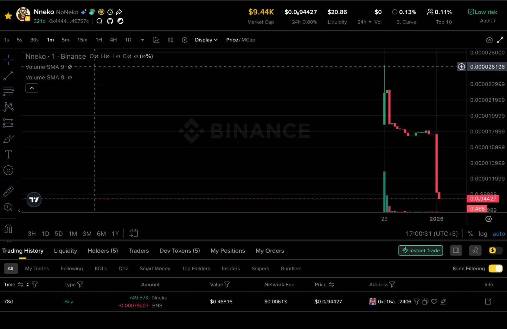
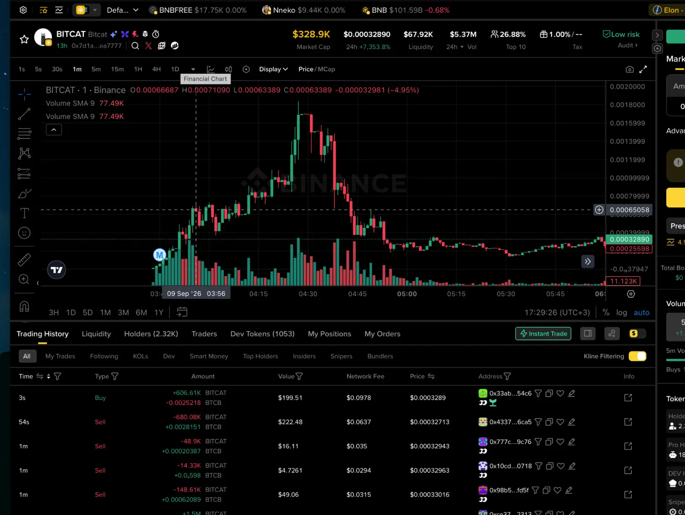

# Binance Skills Hub: We Reviewed 19 Skills and Found No Ready-Made CEX Strategy

**Research dates:** September 8–10, 2026
**Subject:** Binance Skills Hub, the installed Binance CLI, and Binance Web3 Skills
**Review format:** inspection of source files, CLI and API testing, examination of live responses, and manual comparison of selected signals with price charts

## Main conclusion

Binance Skills Hub proved to be a useful collection of interfaces for accessing data and trading infrastructure, but not a source of a ready-made strategy for Binance Spot or Futures. The only tool directly useful for our CEX work was the `binance` skill: it provides access to order books, trades, candles, futures data, and account operations. It contains no independent trading logic.

Every Hub skill that resembles a trading signal or strategy operates in a different market: on-chain DEX trading, meme tokens, young liquidity pools, launchpads, and wallet tracking. This is not the same universe in which our Klines bot operates. Thresholds and conclusions cannot be transferred between these systems without a separate test.

We found no Hub skill that monitors official Binance announcements of future Spot or Futures listings. Binance Alpha inclusion, migration from a bonding curve to a DEX, and listing on a centralized exchange are different events.

> **What was established:** The Hub can retrieve data, display rankings and signals, and execute operations. We did not confirm that any of the reviewed signals produces realizable profit after latency, slippage, fees, and the eventual exit from the position.

## How the review was conducted

We did not begin by selecting an attractive-looking strategy. We started with a complete static audit of 19 skills. Four questions were applied to each one:

1. What exactly is open in the documentation and code?
2. Which parts of the calculation remain hidden on Binance's side?
3. Is it a trading methodology or only an interface for data and execution?
4. Can the reported result be tested without introducing information from the future?

After the static audit, we conducted two laboratories. The first tested the CEX-facing `binance` skill using real public market data. The second installed and ran `binance-trading-signal`, retrieved the catalogue of platform BSC strategies, and manually examined selected tokens. We also installed and ran `crypto-market-rank` to determine whether its rankings represented anything beyond the DEX segment already reviewed.

This order mattered. A label such as "AI strategy," a high win rate, or a chart showing price appreciation after a signal does not yet constitute a trading result. A valid test requires the time at which the signal was actually received, the available execution price, market depth, position size, ability to sell, and a predefined exit rule.

## Laboratory 1: the `binance` skill

The `binance` skill provided working access to Binance CEX data. We tested its public order-book and aggregate-trade commands on QKCUSDT. No API keys were used and no orders were placed.

In the order-book snapshot, the best bid was 0.002704 USDT and the best ask was 0.002710 USDT. The spread relative to the midpoint was approximately 22.16 basis points. Sequentially consuming the displayed ask levels produced the following model estimates:

| Market purchase | Modelled average price | Slippage from best ask |
|---:|---:|---:|
| 100 USDT | 0.002710956038 | 3.53 bps |
| 500 USDT | 0.002712193554 | 8.09 bps |
| 1,000 USDT | 0.002713571321 | 13.18 bps |

The latest 100 aggregate trades contained 38 aggressive-buy records. Aggressive buys represented 35.61% of traded volume, while aggressive sells represented 64.39%. Individual CLI calls took approximately 0.52–0.53 seconds. This was command execution time, not the complete latency of a system that would also include the model, network transmission, and decision-making.

We also tested a 45-second USD-M Futures liquidation stream. One UAIUSDT event with a notional value of approximately 10.27 USDT arrived during that window. The documentation warns that the stream transmits only the latest event for each symbol within a 1,000-millisecond interval, so it cannot be treated as a complete history of all liquidations.

The conclusion from the first laboratory was straightforward: the tool is useful for obtaining CEX data, studying execution, and potentially connecting order operations in the future. But we performed the calculations ourselves. The skill contains no entry rule, exit rule, or demonstrated edge.

## Laboratory 2: `binance-trading-signal`

This skill appears closer to a finished trading system. It combines three sources:

- buy and sell activity from tracked Smart Money wallets;
- platform strategies;
- two types of user-defined configurations: meme-token filtering and reactions to groups of wallets.

However, the signal and backtesting engine is not contained within the skill itself. The local files describe commands, fields, and rules for presenting results. The list of tracked wallets, formulas behind parts of the rankings, and the server-side implementation remain on a closed backend.

### What was open

User-defined meme strategies can apply filters for liquidity, market capitalization, token age, transaction count, and token concentration among different categories of holders. Wallet-reaction strategies can specify a group of addresses, a minimum number of wallets, a time window, and the minimum amount purchased by each address.

This is a useful event-configuration framework. It is not a complete execution system. It does not provide tested answers to the following questions: at what price should a position be entered, at what size, when should profit be taken, where should a protective exit be placed, and what should happen when sufficient liquidity is unavailable?

### What remained a black box

The responses include `winRate`, maximum appreciation after a signal, time to peak, and Gold, Silver, or Bronze classifications. We did not find a precise, reproducible definition of a winning trade or a realized exit.

The maximum price after a signal is a valid research statistic, but it is not trading return. If a token rises from 1 to 6 after entry and the eventual available exit occurs at 0.8, the maximum gain is 500%, while the result of the trade is a 20% loss. Calculating a future maximum does not by itself prove that future information leaked into the signal-generation process. But that maximum cannot be presented as though it had been an available exit rule.

A separate risk arises when historical signals are evaluated using the token's current metrics. Today's liquidity, holder count, or trading volume cannot be substituted into the timestamp of an earlier signal. Doing so introduces look-ahead bias and survivorship bias.

### Historical-data limitation

The installed CLI returns no more than 100 signals per source. We did not obtain complete pagination of the official feed or a ready-made export covering a week or a month. A request for 10,000 records was rejected by local parameter validation.

A defensible monthly test would therefore require separate infrastructure: a complete list of tokens and pools, including those that disappeared; historical trades; bonding-curve states; migrations; liquidity and volume at the actual decision timestamp; token taxes; estimates of executable size; and confirmation that selling was possible. An archival BSC node does not by itself provide a ready-made table containing all these fields.

## Three migration strategies that appeared potentially interesting

We identified three relatively simple events in the platform catalogue:

1. **Flap Near Grad** — bonding-curve progress on Flap above 80%.
2. **Four.meme Near Grad** — bonding-curve progress on Four.meme above 80%.
3. **Graduate in 10 min** — a token on Four.meme or Flap completed its launch in no more than ten minutes.

These conditions are easier to interpret than complex AI rankings. The first two occur before completion of the bonding curve and migration or release of the token into the next market. The third measures how quickly the launch is completed. None of these events, by itself, predicts price appreciation after migration.

We provisionally formulated a tradeability filter requiring at least USD 50,000 in liquidity and at least USD 500,000 in turnover during the preceding 24 hours. Both values would have to be known at the decision timestamp. Such a filter could exclude the earliest events, while a completely new token may not physically have 24 hours of history. The filter was not activated in a Binance account and was not subjected to historical testing.

## What the manual token review showed

Manual inspection was more informative than promotional performance percentages because it quickly exposed different types of outcomes. It remained, however, a qualitative observation of selected examples rather than a statistical sample.

### Liq Breaks 40K signals

We examined several tokens from a strategy that identifies the first time liquidity exceeds USD 40,000.

| Token | Contract | Signal time on Sep. 9, Moscow time | Observation during manual review |
|---|---|---:|---|
| OURO | `0xdb0beb26d4db9a462077fabf1520a922ba257777` | 16:14:48 | The signal appeared close to a local peak |
| HOLD | `0x2f7abaa9a88d91d375a257e33a8b605e83fc7777` | 14:27:29 | Also close to a peak |
| 人生太难了 | `0xb75b67cabd07f307ebf4cc8ef271ce4cca457777` | 11:58:52 | Flat movement without convincing continuation |
| ANTS | `0xc1d308b258e21ed5f3ddc50351d21d2809337777` | 11:20:19 | Flat movement, deterioration, and a rebound |
| LAPTOP | `0x9cd3a3eed3e4a2c832590dd59aa8c3f657bd8888` | 09:24:58 | A more interesting move around migration; the displayed peak was not independently verified |
| Jacob | `0xaac041720be536f291df21396930a25261797777` | 06:47:07 | A weak example based on manual assessment |

These cases illustrate both sides of selection. In some instances, meaningful movement does occur near the event. In others, the signal arrives near the top or receives no continuation. Selecting only attractive charts creates an illusion of regularity.

### STONKVIRUS: an increase on the screen and no defensible conclusion about the trade

A Solana token with the same name was initially opened, revealing another practical problem: a ticker is insufficient; the contract and network must always be specified. We then checked the correct BSC contract, `0x2489cb050ca01fe2ea6252d9b12f275172297777`.

The Flap Near Grad signal appeared at 12:35:05 Moscow time at a price of 0.000028367697292519. Migration was recorded at 12:37:39. The maximum in the feed occurred at 12:39:12 at a price of 0.000053928232312477. The quoted price increased by approximately 90% between the signal and that maximum.

Later, the screenshot showed a price of approximately 0.00000319, around 89% below the signal price. The same case therefore looked simultaneously like a successful pump and an almost complete destruction of the position. Without an actual executable entry quote, available position size, token taxes, slippage, and an exit rule, it is impossible to determine how much of the move could have been captured.

### Nneko: "low risk" does not mean suitable for trading

The author's own Nneko token became a useful control example. The screen showed a market capitalization of approximately USD 9,440, liquidity of USD 20.86, zero trading volume over the preceding 24 hours, and a "Low risk" audit label.

There had been no trading turnover during the preceding 24 hours at the time of the screenshot. This example demonstrates the precise boundary of a contract audit: the absence of an identified technical risk does not create liquidity, demand, or the ability to execute a position. Market capitalization is also not the amount of money that can be withdrawn from a liquidity pool.

### BITCAT: an attractive chart, but not a historical result of the filter

For BITCAT, contract `0x7d1a8dbb40b7b5518ef69b93a6faeba91eea7777`, we found a 2H Vol Breaks 1M signal dated September 9, 2026, at 03:56:36 Moscow time. The signal price was 0.000667299346987974.

The chart showed price appreciation after this point, followed by a decline. Visually, it was one of the more interesting cases. However, liquidity of approximately USD 73,459 and turnover of approximately USD 5.36 million came from a daily snapshot obtained after the signal. BITCAT therefore cannot be counted as a successful historical result of our USD 50,000/500,000 filter. That would require the values that were actually available at 03:56:36.

## What the collector prototype accomplished

The collector was not proposed because the skill could not work without it. The skill can return the current feed on request. The collector serves a different purpose: regularly recording the first time each signal was actually received and the market state at that same moment.

A `collector.py` prototype was produced together with a `radar.db` SQLite database. The prototype queried the public BSC interface for two protocols and three stages: new tokens, bonding-curve completion, and migrated tokens. It stored the complete JSON response for each token and separately recorded preliminary Near Grad and Graduate in 10 min events.

The collector was successfully run once on September 9, 2026, at 20:55:45 UTC. All six requests completed successfully. The database received 523 rows covering 520 unique contracts and 99 preliminary events: 78 fast Flap launches, 17 fast Four.meme launches, and four Four.meme Near Grad events.

These 99 records cannot be treated as forward signals or strategy results. On its first run, the collector had no knowledge of the tokens' previous states. A token that was already above a threshold was recorded as a newly observed event even if it had crossed the threshold before observation began. A single snapshot confirms that the prototype worked and that the data was accessible, but it does not create a time series.

Continuous collection was not started after this run, and the study of subsequent results was not continued.

## Why we did not download the entire BSC history

Without historical data recorded at the time of observation, it is impossible to distinguish forward information from data that became available later. History can be collected independently or obtained from a verified external provider. But a complete reconstruction of BSC quickly becomes a separate data-engineering project. It would require events from all relevant protocols, a list of disappeared pools, swaps, liquidity changes, USD prices, bonding-curve states, and correct consolidation of multiple markets for the same token.

Even access to all these data would not guarantee reproduction of Binance's closed methodology. Candles do not prove that a position of a specified size could have been bought and sold. Pool depth, token taxes, selling restrictions, bot competition, and latency are especially important for DEX meme tokens.

We stopped developing and continuously running the collector because the first decision should be whether we want to study this market at all. The existence of the prototype is not, by itself, a reason to continue a direction that does not closely match our current research objective.

## `crypto-market-rank`: the live rankings confirmed the same DEX bias

After testing the signals, we installed `crypto-market-rank`. It contained five interfaces:

- Social Hype;
- Trending, Top Search, Binance Alpha, and tokenized assets;
- Smart Money Inflow;
- the Pulse meme-token ranking;
- the on-chain wallet PnL ranking.

These are not five strategies. They are five current rankings. The formulas for social hype, breakout score, and the composition of Smart Money remain hidden.

During a live check of BSC Trending over 24 hours on September 10, the response contained 338 tokens. The top of the list included 4Stock, 牛来, VC, Stonks, BITCAT, BEN, うさぎ, ZEC, SOCK, and BNBGUY. Displayed 24-hour changes included VC at +83,706%, BITCAT at +4,195%, and BNBGUY at +2,696%. This live response was not preserved as a separate raw laboratory file, so the exact values are reported as observations from the session rather than as a reproducible dataset.

Figures of this magnitude make the interface visually persuasive, but they say almost nothing about the possibility of entering a position. The ranking shows movement that has already occurred. BNBGUY, for example, had liquidity of approximately USD 32,700, while several subsequent tokens had even less. Our liquidity filter would have excluded them, but that does not turn the remaining sample into a proven strategy.

The built-in Trending ranking does apply minimum filters for liquidity, volume, transaction count, and unique traders. This improves the cleanliness of the output; it is not an entry-and-exit rule with validated performance. The test confirmed that `crypto-market-rank` is another DEX interface rather than a source of CEX signals.

## What was inside all 19 skills

The final classification is shown below. Categories were assigned according to the primary function of each skill so that no tool would be counted twice.

| Skill | Primary function | Conclusion |
|---|---|---|
| `binance` | CEX data and execution | Useful tool, no strategy |
| `fiat` | Fiat operations and history | Infrastructure |
| `onchain-pay` | On-chain payments | Infrastructure |
| `p2p` | P2P market and operations | Infrastructure |
| `payment` | Binance Pay | Infrastructure |
| `square-post` | Content publishing | Not a trading tool |
| `academy-skill` | Educational-content search | Not a trading tool |
| `binance-agentic-wallet` | Web3 wallet, swaps, and DeFi | Execution without a strategy |
| `binance-leaderboard` | On-chain wallet scoring | Testable idea, but again a DEX market |
| `binance-sports-ai-analyzer` | Sports predictions | Outside the scope of this study |
| `binance-tokenized-securities-info` | Tokenized-equity data | Narrow on-chain data source |
| `binance-trading-signal` | Platform and user-defined DEX signals | Partially open methodology; profitability not confirmed |
| `binance-wallet-tracker` | On-chain wallet events and patterns | Hidden thresholds and the same DEX market |
| `crypto-market-rank` | Token and wallet rankings | Current DEX interface |
| `meme-rush` | Launchpads and meme tokens | Noisy DEX segment |
| `query-address-info` | Wallet portfolio snapshot | Reference data |
| `query-token-audit` | Contract-risk screening | Useful safety filter, not an edge |
| `query-token-info` | Token metadata, market data, and candles | Reference data |
| `trading-signal` | Smart Money events | Reduced duplicate of part of `binance-trading-signal` |

The mutually exclusive classification produces six infrastructure skills, six on-chain hypotheses and rankings, four reference-data sources, two content tools, and one skill outside the trading question. The initial audit incorrectly reported seven infrastructure tools while listing only six; the count has been corrected here.

## What the Hub does not contain

The reviewed set contains no ready-made strategy for Binance Spot or Futures. There is no skill that:

- monitors official announcements of new listings;
- defines a CEX entry following publication;
- tests the reaction against a complete historical sample;
- accounts for where the asset traded before Binance opened its market;
- models announcement-delivery latency and actual execution.

This does not establish that a listing strategy is profitable. It remains a hypothesis. However, such a study would be methodologically clearer: the event has an official source, the announcement and the opening of trading have separate timestamps, and prices can be studied on venues where the asset was already trading.

At least three timestamps would have to be distinguished:

1. the time Binance published the announcement;
2. the time our observer first received the announcement;
3. the time trading began on Binance.

A historical purchase at the price available during the exact second of publication is invalid if the system actually received the announcement later. If the token was not accessibly traded anywhere before its Binance listing, the reaction to the announcement also cannot be retroactively converted into a trade.

## Final verdict

The audit of Binance Skills Hub can be considered complete for the reviewed set of 19 skills.

The principal practical outcome was not the discovery of a strategy, but a precise separation of functions:

- `binance` should be retained as a useful CEX tool for data, execution analysis, and possible future order integration;
- `binance-trading-signal`, `crypto-market-rank`, `wallet-tracker`, `meme-rush`, and the related rankings belong to the DEX/on-chain market;
- Smart Money, AI hype, breakout scores, and published win rates contain closed components;
- maximum appreciation after a signal is not realized return;
- current liquidity cannot be used as a historical filter;
- a contract audit does not establish trading suitability;
- none of the reviewed skills provides a ready-made CEX strategy.

We observed both attractive movements around migrations and clear failures. STONKVIRUS demonstrated how a single chart can contain an almost twofold increase followed by an observed price approximately 89% below the signal price. Nneko demonstrated that a low-risk label can coexist with almost nonexistent liquidity. BITCAT demonstrated how a compelling visual example ceases to be evidence when the filter is applied after the event.

Continuing the DEX investigation would therefore require a deliberate decision to work specifically with that market and to accept the cost of prospective data collection in advance. There is currently no sufficient reason to do so for the task under examination.

The clearest next direction is the study of official Binance Spot and Futures listing announcements. This lies outside the reviewed Skills Hub and requires a separate examination of announcement history, delivery times, and the markets available before listing. Until such a test is completed, the statement that "a listing causes price appreciation" remains a hypothesis rather than a trading rule.

## Materials reviewed

- [Binance Skills Hub](https://github.com/binance/binance-skills-hub)
- [Binance Trading Signal Skill](https://github.com/binance/binance-skills-hub/blob/main/skills/binance-web3/binance-trading-signal/SKILL.md)
- [Binance Web3 Supported Skills](https://web3.binance.com/en/dev-docs/products/wallet-skills/supported-skills)
- [Binance Announcements](https://www.binance.com/en/support/announcement)
- [BNB Smart Chain Archive Node](https://docs.bnbchain.org/bnb-smart-chain/developers/node_operators/archive_node/)

The research did not include trading operations and does not confirm the profitability of any strategy. All market examples refer to observations made on the specified dates and must be considered together with the limitations described above.

Open collection prototype: [collector.py](collector.py)
